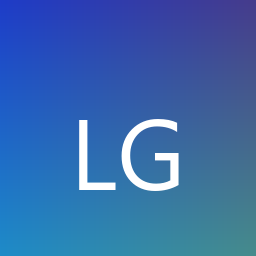

<div align="center">



# LLM Gateway

**桌面 AI 网关 — 零部署，一键管理多供应商、多模型**

<p align="center">
  <a href="./README.md">English</a> |
  <a href="./README.zh_CN.md">简体中文</a>
</p>

<p align="center">
  <a href="https://github.com/Geek-Bob/LLM-GATEWAY"></a>
  <a href="https://github.com/Geek-Bob/LLM-GATEWAY/blob/master/LICENSE"></a>
  <a href="https://github.com/Geek-Bob/LLM-GATEWAY/releases"></a>
  <a href="https://github.com/Geek-Bob/LLM-GATEWAY/actions"></a>
</p>

<p align="center">
  <strong>🎯 一个网关，所有供应商，所有协议</strong><br>
  <sub>用 OpenAI SDK 调 Anthropic 模型？自动转换。用 Anthropic 格式调 OpenAI？也自动转换。</sub>
</p>

</div>

---

## 🚀 为什么选择 LLM Gateway？

### 痛点

- **多供应商管理混乱**：每个 AI 供应商都有自己的 API Key、协议格式、SDK
- **协议不兼容**：OpenAI 和 Anthropic 的 API 格式完全不同，切换成本高
- **缺乏可观测性**：请求日志分散，难以追踪问题
- **部署复杂**：传统网关需要 Docker、服务器、域名配置

### 解决方案

LLM Gateway 是一个 **桌面原生应用**，安装即用，零部署：

- ✅ **协议双向转换**：OpenAI ⇄ Anthropic 全字段自动转换
- ✅ **多供应商统一管理**：一个界面管理所有 API Key 和模型
- ✅ **内置 Chat 客户端**：无需额外工具，直接测试对话
- ✅ **完整可观测性**：请求日志、Token 统计、错误追踪
- ✅ **本地离线运行**：数据全部本地，不上传任何信息

---

## ✨ 核心特性

### 🔄 协议双向转换

支持 OpenAI 和 Anthropic 协议的 **全字段双向转换**：

| 特性 | 支持情况 |
|------|----------|
| `tools` / `function_calling` | ✅ 完整支持 |
| `streaming` 流式响应 | ✅ 完整支持 |
| `thinking` / `reasoning` 思考内容 | ✅ 完整支持 |
| `response_format` 结构化输出 | ✅ 完整支持 |
| `cache_control` 缓存控制 | ✅ 完整支持 |
| `web_search` 网页搜索 | ✅ 完整支持 |
| 图像/媒体内容 | ✅ 完整支持 |

**示例：** 用 OpenAI SDK 调用 Anthropic Claude：

```python
from openai import OpenAI

client = OpenAI(
    base_url="http://localhost:8080/v1",
    api_key="your-gateway-key"
)

# 自动转换为 Anthropic 协议
response = client.chat.completions.create(
    model="anthropic/claude-sonnet-4-20250514",
    messages=[{"role": "user", "content": "Hello!"}]
)
```

### 🏢 多供应商管理

- **无限供应商**：同时配置 OpenAI、Anthropic、Google、本地模型等
- **独立 API Key**：每个供应商独立管理密钥
- **模型路由**：通过 `供应商名/模型名` 自动路由请求

### 🔀 模型映射（Agent 能力释放）

**核心价值：** 让 Claude Code、Cursor、Windsurf 等 Agent 工具使用第三方供应商时，伪装成官方模型 ID，**完整释放 Agent 所有能力**。

**问题：** Agent 工具（如 Claude Code）只对官方模型 ID（如 `claude-sonnet-4-20250514`）启用全部能力（工具调用、思考模式等）。使用第三方供应商的模型 ID 时，Agent 会禁用部分功能。

**解决方案：** LLM Gateway 的模型映射功能：

```
Agent 请求: claude-sonnet-4-20250514
        ↓
   模型映射层
        ↓
实际调用: opencode/qwen3.7-plus
```

**使用场景：**

| 场景 | 映射配置 | 效果 |
|------|----------|------|
| Claude Code + 第三方供应商 | `claude-sonnet-4-20250514` → `opencode/qwen3.7-plus` | Agent 完整能力（工具调用、思考模式） |
| Cursor + 本地模型 | `gpt-4` → `local/llama-3` | IDE 完整功能 |
| 任意 Agent + 任意供应商 | `官方模型ID` → `供应商/模型` | 无损能力迁移 |

**配置示例：**

```json
{
  "model_mappings": [
    {
      "source_model": "claude-sonnet-4-20250514",
      "target_provider": "opencode",
      "target_model": "qwen3.7-plus"
    },
    {
      "source_model": "gpt-4",
      "target_provider": "local",
      "target_model": "llama-3-70b"
    }
  ]
}
```

**优势：**
- ✅ Agent 无法感知映射，完整启用所有能力
- ✅ 支持多级映射链
- ✅ 实时生效，无需重启
- ✅ 映射规则可视化管理

### 💬 内置 Chat 客户端

- **多会话管理**：同时进行多个对话
- **流式响应**：实时显示 AI 回复
- **Thinking 内容**：展示模型的思考过程
- **一键切换模型**：快速测试不同供应商的模型
- **会话历史**：自动保存对话记录

### 📊 可视化仪表盘

- **实时统计**：24h / 30d 请求量、Token 用量
- **多维度分析**：按供应商、模型、时间维度统计
- **错误追踪**：快速定位失败请求
- **性能监控**：响应时间、成功率可视化

### 📝 详细请求日志

- **完整追溯**：每条请求的完整生命周期
- **Debug 模式**：查看协议转换的详细过程
- **NDJSON 格式**：结构化日志，便于分析
- **自动轮转**：日志文件自动管理，不占用过多空间

### 🔒 安全特性

- **本地运行**：数据全部在本地，不上传任何信息
- **加密存储**：API Key 使用 AES-256-GCM 加密
- **速率限制**：按 API Key 的滑动窗口限流，防止滥用
- **输入校验**：所有请求参数严格验证

---

## 🆚 与同类产品对比

| 特性 | LLM Gateway | New API | LiteLLM | One API |
|------|:--:|:--:|:--:|:--:|
| **部署方式** | 桌面安装 | Docker | Python | Docker |
| **零配置启动** | ✅ | ❌ | ❌ | ❌ |
| **OpenAI ⇄ Anthropic 转换** | ✅ | ✅ | ✅ | ✅ |
| **`response_format` 双向转换** | ✅ | ❌ | ❌ | ❌ |
| **`cache_control` 透传** | ✅ | ❌ | ❌ | ❌ |
| **`thinking` 内容支持** | ✅ | ❌ | ❌ | ❌ |
| **`web_search` 支持** | ✅ | ❌ | ❌ | ❌ |
| **模型映射（Agent 能力释放）** | ✅ | ❌ | ❌ | ❌ |
| **内置 Chat 客户端** | ✅ | ❌ | ❌ | ❌ |
| **协议转换可视化日志** | ✅ | ❌ | ❌ | ❌ |
| **桌面原生体验** | ✅ | ❌ | ❌ | ❌ |
| **离线运行** | ✅ | ❌ | ❌ | ❌ |

---

## 🎯 使用场景

### 场景 1：多供应商统一接入

**问题**：团队使用多个 AI 供应商，每个供应商有不同的 API 格式和密钥管理方式。

**解决方案**：LLM Gateway 统一管理所有供应商，客户端只需对接一个网关。

```
客户端 → LLM Gateway → OpenAI
                     → Anthropic
                     → Google
                     → 本地模型
```

### 场景 2：协议兼容性测试

**问题**：需要测试不同供应商的模型，但客户端只支持一种协议格式。

**解决方案**：LLM Gateway 自动转换协议，客户端无需修改代码。

```python
# 同一段代码，切换不同供应商的模型
models = [
    "openai/gpt-4",
    "anthropic/claude-sonnet-4-20250514",
    "google/gemini-pro"
]

for model in models:
    response = client.chat.completions.create(
        model=model,
        messages=[{"role": "user", "content": "Hello!"}]
    )
    print(f"{model}: {response.choices[0].message.content}")
```

### 场景 3：开发调试

**问题**：AI 请求失败，难以定位是客户端问题还是供应商问题。

**解决方案**：LLM Gateway 提供详细的请求日志和 Debug 模式。

- 查看完整的请求/响应内容
- 查看协议转换的详细过程
- 查看 Token 用量和响应时间
- 快速定位错误原因

### 场景 4：成本控制

**问题**：多个供应商的 Token 用量分散，难以统一统计和控制成本。

**解决方案**：LLM Gateway 提供统一的统计仪表盘。

- 按供应商、模型、时间维度统计 Token 用量
- 设置速率限制，防止意外超支
- 查看历史趋势，优化使用策略

### 场景 5：Agent 工具能力释放 ⭐

**问题**：Claude Code、Cursor、Windsurf 等 Agent 工具只对官方模型 ID 启用全部能力（工具调用、思考模式等）。使用第三方供应商时，Agent 会禁用部分功能。

**解决方案**：LLM Gateway 的模型映射功能，让第三方模型伪装成官方模型 ID。

```bash
# Claude Code 配置
ANTHROPIC_BASE_URL=http://localhost:8080
ANTHROPIC_API_KEY=your-gateway-key

# LLM Gateway 模型映射配置
claude-sonnet-4-20250514 → opencode/qwen3.7-plus

# 结果：Claude Code 完整启用所有能力
# - 工具调用 ✅
# - 思考模式 ✅
# - 多轮对话 ✅
# - 代码生成 ✅
```

**实际效果：**
- 使用第三方供应商的便宜模型
- 享受官方模型的完整 Agent 能力
- 成本降低 50-80%，功能无损

---

## 🚀 快速开始

### 下载安装

从 [Releases](https://github.com/Geek-Bob/LLM-GATEWAY/releases) 页面下载对应平台的安装包：

| 平台 | 文件 | 大小 |
|------|------|------|
| Windows | `LLM-Gateway-1.0.2-Setup-x64.exe` | ~140MB |
| macOS | `LLM-Gateway.dmg` | ~150MB |
| Linux | `LLM-Gateway.AppImage` | ~140MB |

### 3 分钟上手

```bash
# 1. 下载并安装
# 2. 打开应用，添加供应商（输入 API Key）
# 3. 创建网关 API Key
# 4. 在客户端配置：
#    Base URL: http://localhost:8080
#    API Key:  你创建的网关 Key
#    Model:    供应商名/模型名
```

### 开发模式

```bash
git clone https://github.com/Geek-Bob/LLM-GATEWAY.git
cd llm-gateway
npm install
npm run dev
```

---

## 📖 使用指南

### 1. 添加供应商

打开 **Providers** 页面，添加你的 AI 供应商：

- **Name**: 供应商名称（如 `anthropic`、`openai`），这会成为模型路由前缀
- **Type**: 选择 `anthropic` 或 `openai`
- **Base URL**: 上游 API 地址
- **API Key**: 你的供应商 API Key
- **Models**: 该供应商支持的模型列表

### 2. 创建网关 API Key

打开 **API Keys** 页面，创建网关自己的 API Key。客户端用这个 Key 连接网关，网关再用供应商的 Key 转发请求。

### 3. 配置客户端

代理服务器默认运行在 `localhost:8080`。在你的 AI 客户端中：

```
Base URL: http://localhost:8080
API Key:  你创建的网关 API Key
Model:    供应商名/模型名（如 anthropic/claude-sonnet-4-20250514）
```

支持两种认证方式：
- `Authorization: Bearer <key>`
- `X-Api-Key: <key>`

### 4. 使用 Chat

打开 **Chat** 页面，选择供应商、模型和 API Key，直接对话。支持：

- 流式响应
- Thinking 内容展示
- 多会话管理
- 会话历史持久化

### 5. 查看日志和统计

- **Logs** 页面：查看每条请求的详情，开启 Debug 模式可看到完整的协议转换过程
- **Dashboard** 页面：查看请求量、Token 用量、错误率等统计图表

---

## 🔧 API 端点

代理服务器运行在 `localhost:8080`（端口可配置）。

| 端点 | 协议 | 说明 |
|------|------|------|
| `POST /v1/chat/completions` | OpenAI | Chat Completions |
| `POST /v1/messages` | Anthropic | Messages |
| `GET /v1/models` | — | 列出所有可用模型 |
| `GET /health` | — | 健康检查 |

---

## 🛠️ 技术栈

| 层 | 技术 | 说明 |
|------|------|------|
| 框架 | Electron 42 | 跨平台桌面应用 |
| 前端 | React 19 + Tailwind CSS 4 | 现代化 UI |
| 代理 | Hono 4 | 高性能 Web 框架 |
| 数据库 | sql.js (SQLite WASM) | 本地存储，无需服务 |
| 日志 | NDJSON 分片 | 结构化日志，自动轮转 |
| 测试 | Vitest + Testing Library | 294 个测试用例 |

---

## 📐 技术架构

```
┌─────────────────────────────────────────────────────────────┐
│                      Electron 桌面应用                        │
├─────────────────────────────────────────────────────────────┤
│  ┌─────────────┐  ┌─────────────┐  ┌─────────────┐          │
│  │   React UI  │  │   Chat UI   │  │  Dashboard  │          │
│  └──────┬──────┘  └──────┬──────┘  └──────┬──────┘          │
│         │                │                │                  │
│         └────────────────┼────────────────┘                  │
│                          │                                   │
│                    ┌─────▼─────┐                             │
│                    │   IPC     │                             │
│                    └─────┬─────┘                             │
│                          │                                   │
│  ┌───────────────────────┼───────────────────────┐          │
│  │                       │                       │          │
│  ▼                       ▼                       ▼          │
│ ┌─────────┐      ┌──────────────┐      ┌─────────────┐     │
│ │ SQLite  │      │   Proxy      │      │   Logger    │     │
│ │ (sql.js)│      │   (Hono)     │      │  (NDJSON)   │     │
│ └─────────┘      └──────┬───────┘      └─────────────┘     │
│                         │                                    │
│                   ┌─────▼─────┐                              │
│                   │  Protocol │                              │
│                   │ Converter │                              │
│                   └─────┬─────┘                              │
│                         │                                    │
└─────────────────────────┼────────────────────────────────────┘
                          │
        ┌─────────────────┼─────────────────┐
        │                 │                 │
        ▼                 ▼                 ▼
   ┌─────────┐      ┌─────────┐      ┌─────────┐
   │ OpenAI  │      │Anthropic│      │  Other  │
   │   API   │      │   API   │      │   API   │
   └─────────┘      └─────────┘      └─────────┘
```

详细的模块分层、数据流、设计模式请参阅 [技术架构文档](docs/ARCHITECTURE.md)。

---

## 🤝 贡献指南

欢迎贡献代码！请遵循以下步骤：

1. Fork 本仓库
2. 创建特性分支 (`git checkout -b feature/AmazingFeature`)
3. 提交更改 (`git commit -m 'Add some AmazingFeature'`)
4. 推送到分支 (`git push origin feature/AmazingFeature`)
5. 创建 Pull Request

### 开发规范

- 使用 TypeScript 严格模式
- 遵循 ESLint 规则
- 编写测试用例
- 更新文档

---

## 📄 许可证

[MIT](LICENSE)

---

<div align="center">

**如果这个项目对你有帮助，请给我们一个 Star！**

[](https://star-history.com/#Geek-Bob/LLM-GATEWAY&Date)

---

<p align="center">
  <sub>Built with ❤️ by the LLM Gateway Team</sub>
</p>

</div>
