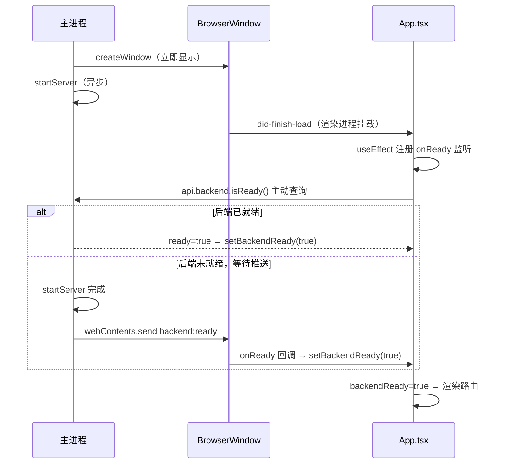
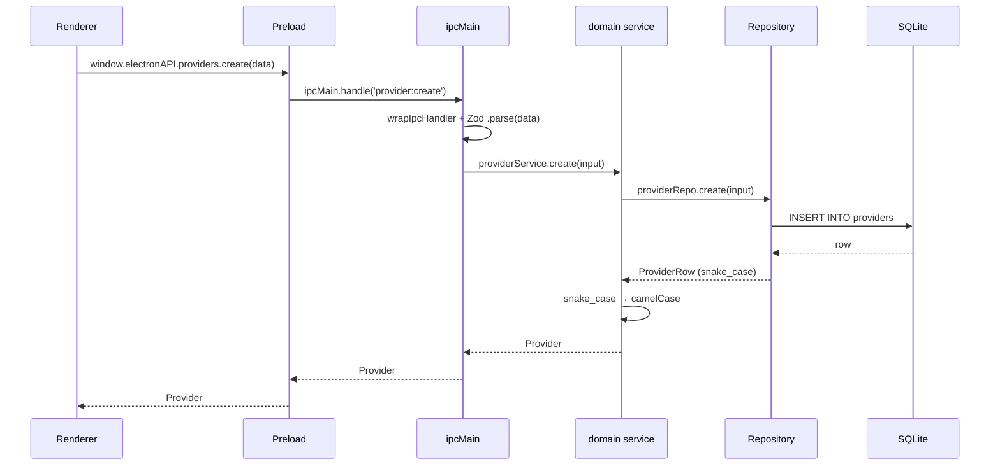
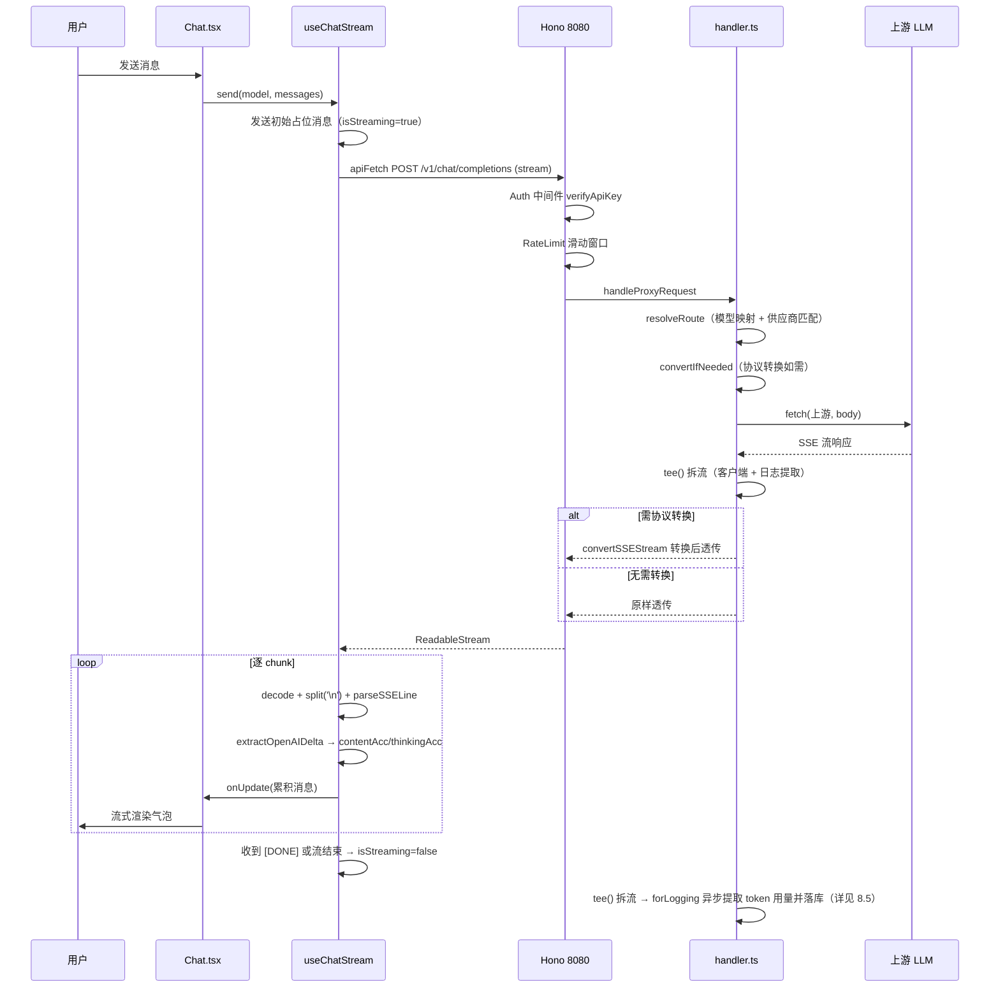
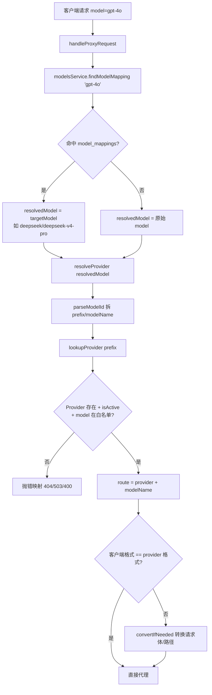
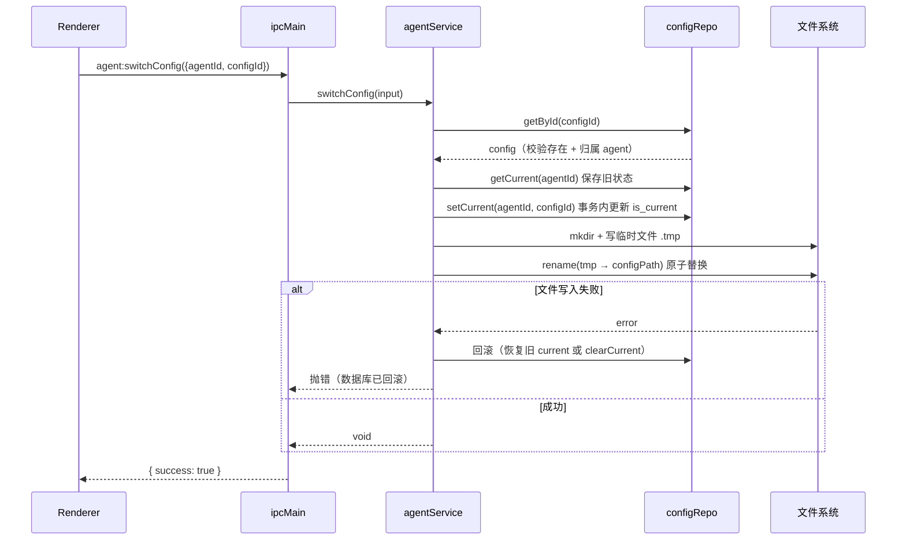
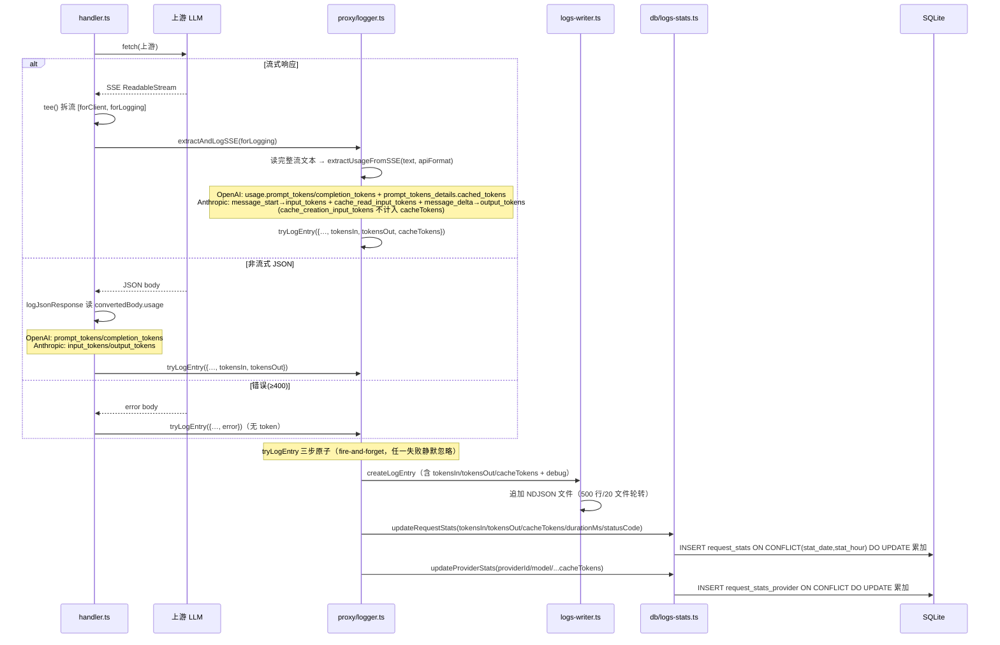
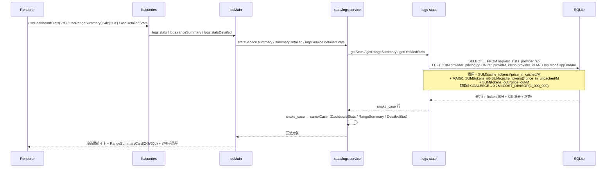
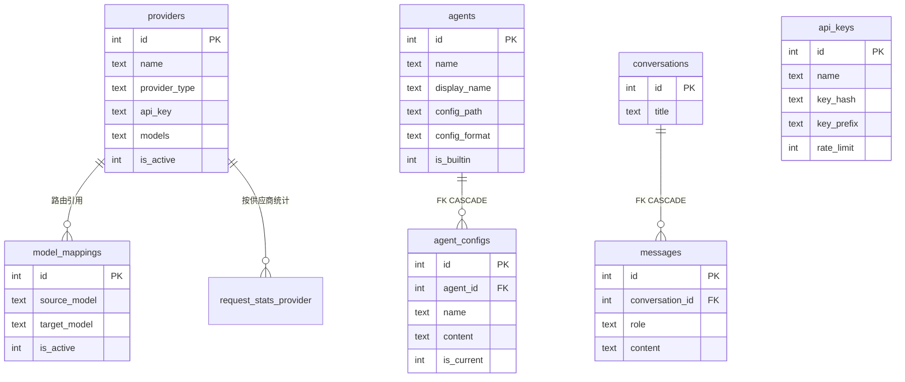

# LLM Gateway 架构技术手册

> 面向新成员的项目入门文档。图表为主、文字为辅，配合 `.claude/rules/` 规则文件与源码阅读。
> 技术栈：Electron 42.x + TypeScript 6.0 + React 19.2

---

## 一、项目概述

多 LLM 供应商统一代理 + 聊天 + 仪表盘的 Electron 桌面客户端。

| # | 功能 | 说明 |
|---|------|------|
| 1 | 多 LLM 供应商代理 | 本地 HTTP 服务器代理 OpenAI/Anthropic 请求，自动协议转换 |
| 2 | 聊天界面 | 对话式 AI 交互，流式 SSE + Mermaid 图表渲染 |
| 3 | 管理仪表盘 | 供应商 / API Key / 请求日志与统计 |
| 4 | 模型映射 | 客户端模型名（`gpt-4o`）映射到实际供应商模型（`deepseek/deepseek-v4-pro`） |
| 5 | Agent 配置管理 | 管理 AI 编程助手（Claude Code/Codex/Gemini CLI）配置文件，多版本切换 |

---

## 二、技术栈

### 运行时依赖

| 技术 | 用途 | 版本 |
|------|------|------|
| Electron | 桌面壳（无 frame，自定义 TitleBar） | 42.x |
| React | UI（仅函数组件） | 19.2 |
| React Router | 路由（HashRouter） | 7.x |
| TanStack Query | 数据请求（数组 queryKey） | 5.x |
| Tailwind CSS | 样式（Dark-only） | 4.3 |
| Hono | HTTP 框架（仅 proxy） | 4.x |
| sql.js | 嵌入式 SQLite（WASM） | 1.x |
| Framer Motion | 动画 | 12.x |
| Recharts | 图表 | 3.x |
| react-markdown | Markdown（GFM + 高亮） | 10.x |
| Mermaid | 图表渲染 | 11.x |
| Shiki | 代码高亮（5 语言） | 4.x |
| rehype-raw / rehype-sanitize | HTML 解析 / XSS 防护 | 7.x / 6.x |
| Radix UI | 原语组件 | — |
| Zod | 输入校验（IPC 入口） | 4.x |

### 构建与规范

| 技术 | 用途 | 版本 |
|------|------|------|
| TypeScript | 语言（禁 enum/namespace/装饰器） | 6.0 |
| electron-vite | 三进程构建（main/preload/renderer） | 5.x |
| Vite | 底层构建引擎 | 6.4 |
| electron-builder | 打包（Win NSIS / Mac DMG / Linux AppImage+deb） | 26.x |
| ESLint | 代码检查 | 10.x |
| Vitest | 测试（前后端配置分离） | 4.x |
| jsdom | DOM 环境（前端测试） | 29.x |

---

## 三、目录结构

> 仅展示结构与工厂签名。各层职责见第五节，导入约束见 `.claude/rules/backend/30-layered-architecture.md`。

```
src/
├── main/                     # 主进程
│   ├── index.ts              # 入口层：窗口/Tray/启动（getDb 后注入 setupIpcHandlers）
│   ├── core/                 # 基础设施层（4 文件）
│   │   ├── logger.ts / config-migration.ts / debug-log.ts / version.ts
│   │   └── __tests__/
│   ├── ipc/                  # 接口层：IPC handler（按域拆分，54 handle + 4 on）
│   │   ├── index.ts          # 注册编排（接收入口层注入的 db）
│   │   ├── ipc-utils.ts      # wrapIpcHandler 统一 try/catch
│   │   ├── sse-parser.ts     # SSE 行解析
│   │   ├── {domain}.ts       # providers/apikeys/conversations/logs/models/agents/proxy/system/update/pricing
│   │   └── __tests__/
│   ├── db/                   # 数据层（8 个 Repository 工厂 + NDJSON 裸函数）
│   │   ├── connection.ts / database.ts / schema.ts(10 表)
│   │   ├── {entity}.ts       # create{Provider,ApiKey,Conversation,ModelMapping,Agent,AgentConfig,LogStats,Pricing}Repository(db)
│   │   ├── logs-reader.ts / logs-writer.ts / logs.ts  # NDJSON 裸函数（不适用 Repository 模式）
│   │   └── __tests__/
│   ├── domains/              # 业务层（9 domain，三件套：types/schema/service）
│   │   └── {provider,apikey,conversation,models,agent,logs,stats,datamanagement,pricing}/
│   │       └── __tests__/
│   ├── proxy/                # 接口层：HTTP 代理（Hono，仅 Chat）
│   │   ├── server.ts / handler.ts / manager.ts / router.ts / forwarder.ts
│   │   ├── stream.ts / logger.ts / middleware.ts / rate-limiter.ts
│   │   ├── converter/        # types/request/response/sse/index
│   │   └── __tests__/
│   └── update/               # 自动更新（manager/config/ipc/update.schema）
│       └── __tests__/
├── preload/                  # contextBridge 桥接（index.ts + types.ts，type alias 派生 shared/types）
├── renderer/                 # 渲染进程
│   ├── main.tsx / App.tsx    # 入口：QueryClientProvider / 路由 + 启动门控
│   ├── pages/                # 8 页面（薄层组合，≤130 行；Logs 例外 ~319）
│   ├── components/
│   │   ├── ui/               # shadcn/ui 纯原子（21 个）
│   │   ├── shared/           # 通用业务组件（9 个）
│   │   └── Layout / TitleBar / ErrorBoundary
│   ├── features/             # 功能域组件（chat/agent/apikey/provider/model-mapping/dashboard/update）
│   ├── hooks/                # 全局通用 hooks
│   └── lib/
│       ├── ipc.ts / types.ts / utils.ts / animations.ts / api-client.ts / shiki.ts
│       └── queries/          # TanStack Query hooks（按域分文件）
└── shared/                   # 跨进程共享（types.ts 实体定义 + sse-utils.ts）

scripts/                      # migrate-db / migrate-logs / migrate-pricing-cache / test-* 调试脚本
.claude/rules/                # 规则模块 17 个（common 2 + frontend 6 + backend 9）
docs/                         # standards/ + superpowers/(SDD/TDD 文档)
```

---

## 四、整体架构

5 层分层 + 3 进程边界。依赖方向：上层 → 下层（单向，编译器可检查）。

```mermaid
graph TB
    subgraph "Renderer 进程 (React)"
        RP[pages / features]
        RQ[lib/queries TanStack Query]
        RAPI[lib/ipc.ts + lib/api-client.ts]
    end
    subgraph "Preload (contextBridge)"
        PRE[electronAPI 桥接]
    end
    subgraph "Main 进程 (Electron)"
        subgraph L1["入口层"]
            IDX[index.ts 窗口/Tray/启动]
        end
        subgraph L2["接口层"]
            IPC[ipc/ IPC handler]
            PROXY[proxy/ Hono 8080]
        end
        subgraph L3["业务层"]
            DOM[domains/ service]
        end
        subgraph L4["数据层"]
            DB[db/ Repository + sql.js]
            NDJSON[logs-reader/writer NDJSON]
        end
        subgraph L5["基础设施层"]
            CORE[core/ logger 等]
        end
    end
    subgraph "上游"
        UP[OpenAI / Anthropic API]
    end

    RP --> RQ --> RAPI
    RAPI -->|IPC 业务 CRUD| PRE --> IPC --> DOM --> DB
    RAPI -->|HTTP SSE Chat| PROXY
    PROXY -->|fetch| UP
    IDX -.注入 db.-> IPC
    IDX -.注入 db.-> DOM
    PROXY -.工厂注入.-> DOM

    style L1 fill:#1e293b
    style L2 fill:#312e81
    style L3 fill:#064e3b
    style L4 fill:#7c2d12
    style L5 fill:#3730a3
```



**两条通信路线：**

| 路线 | 用途 | 协议 | 链路 |
|------|------|------|------|
| 业务 CRUD | Provider/APIKey/对话/日志/模型映射/Agent | IPC | lib/ipc.ts → preload → ipcMain.handle → service → Repository |
| Chat 流式 | 聊天 SSE | HTTP | api-client.ts → Hono 8080 → upstream |

---

## 五、各层职责

### 5.1 数据库层 (db/)

sql.js（WASM SQLite），与主进程同进程。10 张表：

| 表 | 主键 | 用途 |
|----|------|------|
| `providers` | id | LLM 供应商配置（API Key、模型列表） |
| `model_mappings` | id | 模型映射（source_model → target_model，UNIQUE） |
| `api_keys` | id | Gateway 密钥（SHA256 哈希 + 明文） |
| `request_stats` | (stat_date, stat_hour) | 请求统计汇总（token/请求/耗时/错误/cache_tokens 按日时累加，由 tryLogEntry 写入） |
| `request_stats_provider` | (stat_date, stat_hour, provider_id, model) | 按供应商/模型统计（同上，多 provider_id+model 维度，含 total_cache_tokens） |
| `provider_pricing` | (provider_id, model) | 供应商×模型单价（缓存命中/未命中/输出，元/百万tokens，FK→providers CASCADE） |
| `conversations` | id | 对话列表 |
| `messages` | id | 对话消息（FK→conversations，CASCADE） |
| `agents` | id | Agent 配置（name UNIQUE、config_path、config_format） |
| `agent_configs` | id | Agent 配置版本（FK CASCADE、is_current、UNIQUE(agent_id,name)） |

**Repository 工厂模式：** `db/{entity}.ts` 统一为 `createXxxRepository(db)` 工厂，返回纯 CRUD 方法，内部禁止 `getDb()`。注入链：`main/index.ts#getDb()` → `createXxxService(db)` → `createXxxRepository(db)`。

| Repository | 文件 | 返回类型 |
|------------|------|---------|
| ProviderRepository | `db/providers.ts` | `ProviderRow` |
| ApiKeyRepository | `db/api-keys.ts` | `ApiKeyRow` |
| ConversationRepository | `db/conversations.ts` | `ConversationRow`/`MessageRow` |
| ModelMappingRepository | `db/model-mappings.ts` | `ModelMappingRow` |
| AgentRepository | `db/agents.ts` | `AgentRow` |
| AgentConfigRepository | `db/agent-configs.ts` | `AgentConfigRow` |
| LogStatsRepository | `db/logs-stats.ts` | 统计 DTO |
| PricingRepository | `db/provider-pricing.ts` | `PricingRow` |

> `logs-writer.ts`/`logs-reader.ts` 为 NDJSON 裸函数（不在 sql.js 范围），不适用 Repository 模式。
> 业务规则（not-found/启用态/唯一性）在 service 层，Repository 只做纯 CRUD。事务用 `BEGIN/COMMIT/ROLLBACK` 显式控制（sql.js 无声明式 API）。

### 5.2 代理层 (proxy/)

Hono 监听 `127.0.0.1:8080`。模块职责：

| 文件 | 职责 |
|------|------|
| `server.ts` | Hono 应用（路由 + CORS/Auth/RateLimit 中间件链） |
| `handler.ts` | 请求编排器（解析→路由→fetch→响应分发→日志） |
| `router.ts` | 模型 ID → 供应商路由（`parseModelId` + `resolveProvider`） |
| `forwarder.ts` | 上游 URL/Header 构建 |
| `converter/` | OpenAI ↔ Anthropic 协议转换（request/response/sse） |
| `stream.ts` | SSE 流转换服务 |
| `logger.ts` | extractUsageFromSSE 提取 token（含 cacheTokens 缓存命中）→ tryLogEntry 三步落库（NDJSON + request_stats + request_stats_provider） |
| `middleware.ts` | Auth 中间件（Bearer token 提取） |
| `rate-limiter.ts` | 滑动窗口限流器 |
| `manager.ts` | 代理生命周期管理 |

**路由表：**

| 路由 | 方法 | 用途 |
|------|------|------|
| `/v1/chat/completions` | POST | OpenAI 格式代理 |
| `/v1/messages` | POST | Anthropic 格式代理 |
| `/v1/models` | GET | 可用模型列表 |
| `/health` | GET | 健康检查 |

**认证头差异：** Anthropic 用 `x-api-key`，OpenAI 用 `Authorization: Bearer`，`forwarder.ts` 按 providerType 处理。

### 5.3 业务域层 (domains/)

9 个 domain，每个三件套（types/schema/service）：

| Domain | service 关键方法 | 备注 |
|--------|-----------------|------|
| provider | list/getById/create/update/remove | — |
| apikey | list/getById/create/remove | API Key 生成/校验 |
| conversation | list/getById/create/update/remove/messages/addMessage | 含消息 |
| models | getAllModels/findModelMapping + 映射 CRUD | 供 proxy 调用 |
| agent | Agent CRUD + 配置版本 CRUD + switchConfig | 业务规则最复杂 |
| logs | query/stats/detailedStats | 委托 NDJSON reader；detailedStats 每模型带 cost（JOIN pricing） |
| stats | summary/summaryDetailed | summary 委托 logs-stats（+cacheTokens+totalCost）；summaryDetailed 24h/30d 全局汇总 JOIN pricing 算费用 |
| datamanagement | clear | 按模块清空（业务数据事务原子 + 运行数据分步），跨聚合根编排 |
| pricing | list/getByProvider/upsert/remove | 供应商×模型单价 CRUD（供应商删除时 FK CASCADE + removeByProvider 双保险） |

**注入契约：** `createXxxService(db)` → 内部 `createXxxRepository(db)`。service 做 snake_case→camelCase 映射 + 业务规则判断 + 异常抛出（格式 `Failed to {action} {entity}: {reason}`）。

### 5.4 IPC 层 (ipc/)

54 个 `ipcMain.handle` + 4 个 `ipcMain.on`，按域拆分文件，全部经 `wrapIpcHandler` 包装（ZodError → `Invalid input: ...`，其他 → 日志 + `{error}`）。

| 域 | 通道 | handler 文件 |
|----|------|-------------|
| backend | `backend:isReady`（index.ts 直注） | index.ts |
| provider | list/create/update/delete | providers.ts |
| apikey | list/create/delete | apikeys.ts |
| conversation | list/create/update/delete/getById/listMessages/createMessage | conversations.ts |
| logs | list/stats/statsDetailed/rangeSummary | logs.ts |
| models | list + mapping:find/list/create/update/delete | models.ts |
| agent | list/getById/create/update/delete + listConfigs/getConfig/createConfig/updateConfig/deleteConfig/switchConfig/readConfigFile | agents.ts |
| datamanagement | clear | datamanagement.ts |
| pricing | list/getByProvider/upsert/delete | pricing.ts |
| proxy | get/start/stop/updatePort/update | proxy.ts |
| update | check/download/install/skipVersion/getConfig/setConfig/getCurrentVersion | update/ipc.ts |
| system | window:minimize/maximize/close（on）+ renderer:log（on） | system.ts |

### 5.5 预加载层 (preload/)

`contextBridge.exposeInMainWorld` 暴露 `window.electronAPI`，按域聚合（backend/providers/apiKeys/conversations/logs/models/agents/proxy/update/window/pricing）。`types.ts` 通过 type alias 派生 `shared/types.ts`，禁止重复定义实体。

### 5.6 渲染进程 (renderer/)

| 页面 | 路由 | 功能 |
|------|------|------|
| Dashboard | `/` | 代理开关/端口、4 张统计卡（含近 7 天花费）、24h/30d 汇总卡（RangeSummaryCard）、趋势图 |
| Providers | `/providers` | 供应商 CRUD、API Key 查看/复制、模型管理 |
| ApiKeys | `/api-keys` | 两步创建（表单→展示明文）、删除确认 |
| Logs | `/logs` | 分页表格、Debug 切换、详情面板 |
| Chat | `/chat` | 会话列表、供应商/模型/APIKey 选择、流式渲染 |
| ModelMappings | `/model-mappings` | 模型映射 CRUD、状态切换 |
| Agents | `/agents` | Agent 配置、CodeEditor 编辑、多版本切换 |
| Settings | `/settings` | 更新配置、版本信息 |

- **数据流：** pages → `lib/queries/`（TanStack Query，queryKey `['domain','action',...params]`）→ `lib/ipc.ts`。组件内禁止直接 `useQuery`/IPC。
- **QueryClient：** staleTime 30s，无 refetchOnWindowFocus，retry 0。
- **全局 hooks：** useClipboard / useDeleteWithToast / useSavingAction / useUpdateCheck。
- **路由级代码分割：** 8 页面 `React.lazy` + `Suspense`。

### 5.7 更新模块 (update/)

| 文件 | 职责 |
|------|------|
| `manager.ts` | electron-updater 封装（延迟导入，事件广播渲染进程） |
| `config.ts` | `update-config.json` 持久化 + `applyMigrators` 字段迁移 |
| `ipc.ts` | 7 个更新 IPC handler |
| `update.schema.ts` | `updateConfigPartialSchema`（`.strict()` 拒绝未知字段） |

---

## 六、项目启动流程

```mermaid
flowchart TD
    A[app.whenReady] --> B[创建 UpdateManager]
    B --> C[createWindow + createTray<br/>立即显示窗口]
    C --> D[startServer 异步初始化]
    D --> D1[initDatabase + createTables]
    D1 --> D2[initLogsDir NDJSON]
    D2 --> D3[组装 initProxyServices<br/>注入 verifyApiKey/logEntry/stats/models/lookupProvider]
    D3 --> D4[setProxyPort + setDebugMode<br/>dev=true / 生产=false]
    D4 --> D5[startProxy Hono 8080]
    D5 --> E[setupIpcHandlers<br/>注入 db 注册各域 handler]
    E --> F[notifyBackendReady<br/>webContents.send backend:ready]
    F --> G[窗口 did-finish-load<br/>非 dev 延迟 3s 检查更新]

    style D fill:#312e81
    style E fill:#064e3b
```



**关键时序：** 窗口先于后端就绪显示（用户感知延迟低），后端异步初始化完成后推送 `backend:ready`。

---

## 七、前后端加载门控

解决"渲染进程挂载晚于/早于 backend:ready"的双向时序竞态：



未就绪时 App.tsx 显示"正在初始化服务..."loading，避免空白。

---

## 八、数据流时序图

### 8.1 业务 CRUD（IPC 链路）



### 8.2 Chat 流式代理（HTTP 链路）



### 8.3 模型映射路由



### 8.4 Agent 配置切换



### 8.5 Token 用量提取与落库

每次代理请求结束时，从上游响应提取 token 用量并写入 NDJSON 日志 + 两张 SQLite 统计表。提取分三种路径，落库统一走 `tryLogEntry` 三步原子操作。



**关键点：**
- 流式与非流式分支提取 token 的位置不同（SSE 文本 vs JSON body.usage），但产出相同的 `{tokensIn, tokensOut}` 后汇入 `tryLogEntry`。流式分支额外提取 `cacheTokens`（缓存命中输入 token）。
- 缓存 token 采集口径二分法：OpenAI 取 `usage.prompt_tokens_details.cached_tokens`；Anthropic 取 message_start 的 `usage.cache_read_input_tokens`（`cache_creation_input_tokens` 写缓存不计入）。无缓存字段时 `cacheTokens=0`。
- 统计采用**预聚合**：每次请求 INSERT 一行增量，`ON CONFLICT(stat_date, stat_hour, ...)` 时累加 total_requests/tokens/errors/duration，避免查询时全量扫描 NDJSON。Dashboard 统计卡片读这两张表。
- token 用量**只在请求落库时一次性写入** NDJSON（明细）+ 统计表（聚合），全程 fire-and-forget，不阻塞代理响应。

### 8.6 仪表板统计与费用计算（IPC 链路）

Dashboard 三类统计查询统一走 IPC → stats/logs service → `logs-stats` Repository；费用通过 `request_stats_provider LEFT JOIN provider_pricing` 实时计算（单价不持久化费用，单价变更后历史查询自动重算）。



**关键点：**
- 费用计算是业务规则（缺单价归 0、非缓存输入 clamp 到 0、实时算不存储），归属 stats service；SQL JOIN 一次聚合完成。
- `request_stats`（全局表）无 model 维度，费用通过 `request_stats_provider`（provider×model 维度）JOIN pricing 计算后再聚合到全局。
- token 三分（缓存/非缓存/输出）与费用三分一一对应：`uncachedTokens = MAX(0, inputTokens - cacheTokens)`。
- 单价经供应商编辑表单 `pricing:upsert` 写入 `provider_pricing`（与 provider 保存同一流程），供应商删除时 FK `ON DELETE CASCADE` + Repository `removeByProvider` 双保险清理。

---

## 九、数据模型



> `request_stats`（按日时汇总）、`request_stats_provider`（按日时+供应商+模型）为统计聚合表，无外键关联。
> `provider_pricing`（provider_id+model 主键，FK→providers ON DELETE CASCADE）存供应商×模型单价，统计查询 LEFT JOIN 实时算费用（不存储费用）。

---

## 十、关键数据格式

```typescript
// 模型映射（snake_case Row → camelCase 实体）
interface ModelMapping { id: number; sourceModel: string; targetModel: string; isActive: number; createdAt: string }

// 模型信息
interface ModelInfo { id: string; provider: string; providerType: 'anthropic' | 'openai' }

// Agent 实体
interface AgentEntity { id: number; name: string; displayName: string; configPath: string; configFormat: 'json'|'toml'|'env'; isBuiltin: number; createdAt: string; updatedAt: string }

// Agent 配置版本
interface AgentConfigEntity { id: number; agentId: number; name: string; content: string; isCurrent: number; createdAt: string; updatedAt: string }

// 更新配置
interface UpdateConfig { isAutoCheckEnabled: boolean; checkInterval: number; isPrereleaseAllowed: boolean; skipVersion: string | null }

// 调试日志（debug 模式记录）
interface LogDebugInfo { client: { body, apiFormat }; route: { providerName, providerType, baseUrl, modelName }; conversion?: { from, to, originalPath, convertedPath, originalModel, convertedModel }; upstream: { url, body, statusCode, responseBody }; error?: string }

// 供应商×模型单价（跨进程，元/百万tokens）
interface PricingEntity { providerId: number; model: string; priceInCached: number; priceInUncached: number; priceOut: number }

// 范围汇总（24h / 30d 全局，token 三分 + 费用三分 + 次数）
interface RangeSummary { totalTokens: number; inputTokens: number; cacheTokens: number; uncachedTokens: number; outputTokens: number; totalCost: number; cacheCost: number; uncachedCost: number; outputCost: number; totalRequests: number }
```

**SSE 格式对照：**

| 协议 | 格式 |
|------|------|
| OpenAI | `data: {"choices":[{"delta":{"content":"..."}}]}\n\n` |
| Anthropic | `event: content_block_delta\ndata: {"delta":{"type":"text_delta","text":"..."}}\n\n` |

---

## 十一、测试

vitest（前后端配置分离）+ jsdom。数据库测试用 sql.js 内存库不 mock，测试文件与源 co-located。

| 层级 | 文件数 |
|------|--------|
| db/ | 14 |
| domains/ | 16 |
| proxy/ | 8 |
| ipc/ | 6 |
| core/ | 4 |
| update/ | 4 |
| renderer/ | 13 |

**合计约 798 用例**（后端 52 文件 + 前端 13 文件，前端含 1 类型断言文件由 vitest typecheck 计入）。

---

*本文档配合 `.claude/rules/` 规则文件与源码阅读。*
