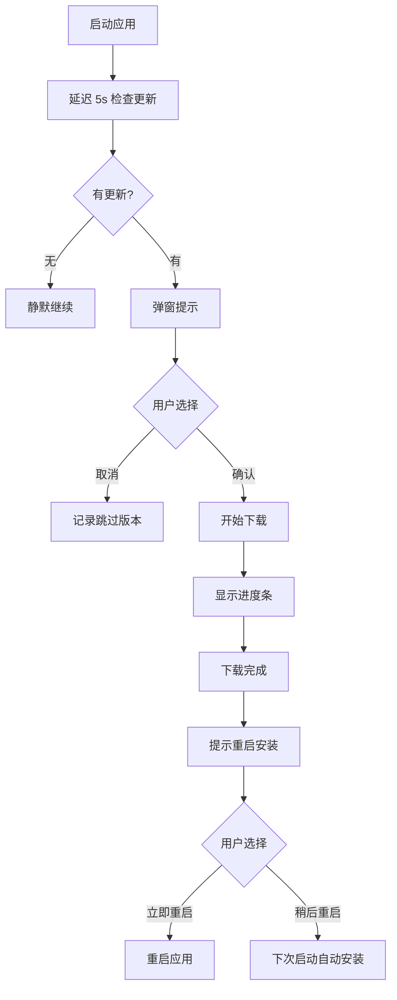

# LLM Gateway 自动更新功能设计文档

## 概述

为 LLM Gateway Electron 应用添加自动更新功能，支持全平台（Windows、macOS、Linux），使用 GitHub Releases 托管更新包，通过 electron-updater 实现自动下载和安装。

## 目标

1. 支持应用启动时自动检查更新
2. 支持定时检查更新（每 4 小时）
3. 支持手动检查更新
4. 提供友好的更新提示 UI
5. 显示下载进度
6. 支持延迟重启安装

## 技术选型

- **更新库**：electron-updater（electron-builder 内置）
- **发布平台**：GitHub Releases
- **UI 组件**：shadcn/ui（Dialog、Progress、AlertDialog）
- **通知**：Sonner toast

## 架构设计

### 核心组件

```
src/main/update/
├── manager.ts      # 更新管理器（检查、下载、安装）
├── config.ts       # 更新配置
└── ipc.ts          # IPC 通信

src/renderer/components/update/
├── UpdateDialog.tsx      # 更新提示对话框
├── DownloadProgress.tsx  # 下载进度组件
└── UpdateButton.tsx      # 手动检查更新按钮
```

### 数据流

```
┌─────────────────────────────────────────────────────────┐
│                     Main Process                        │
│  ┌─────────────┐    ┌─────────────┐    ┌─────────────┐  │
│  │ UpdateManager│───▶│electron-updater│───▶│GitHub Releases│ │
│  └─────────────┘    └─────────────┘    └─────────────┘  │
│          │                                          │
│          ▼                                          │
│  ┌─────────────┐                                   │
│  │   IPC Main   │                                   │
│  └─────────────┘                                   │
└─────────────────────────────────────────────────────────┘
                    │
                    ▼
┌─────────────────────────────────────────────────────────┐
│                   Renderer Process                      │
│  ┌─────────────┐    ┌─────────────┐    ┌─────────────┐  │
│  │  IPC Preload │───▶│  UpdateUI   │───▶│  Toast/Dialog│ │
│  └─────────────┘    └─────────────┘    └─────────────┘  │
└─────────────────────────────────────────────────────────┘
```

## 功能设计

### 1. 更新检查时机

#### 自动检查
- **启动时**：延迟 5 秒检查，避免影响启动速度
- **定时检查**：每 4 小时检查一次（可配置）

#### 手动检查
- **菜单**：帮助菜单中添加"检查更新"选项
- **设置页面**：添加"检查更新"按钮

### 2. 更新流程



### 3. UI 设计

#### 更新提示对话框

```tsx
<Dialog>
  <DialogContent>
    <DialogHeader>
      <DialogTitle>发现新版本 v1.2.0</DialogTitle>
      <DialogDescription>
        当前版本：v1.1.0
      </DialogDescription>
    </DialogHeader>

    <div className="space-y-4">
      <div>
        <h4>更新内容</h4>
        <ul>
          <li>修复了 xxx 问题</li>
          <li>新增了 xxx 功能</li>
        </ul>
      </div>

      <div className="flex items-center gap-2">
        <Checkbox id="skip-version" />
        <Label htmlFor="skip-version">跳过此版本</Label>
      </div>
    </div>

    <DialogFooter>
      <Button variant="outline" onClick={onCancel}>稍后再说</Button>
      <Button onClick={onUpdate}>立即更新</Button>
    </DialogFooter>
  </DialogContent>
</Dialog>
```

#### 下载进度组件

```tsx
<Toast>
  <div className="flex items-center gap-4">
    <Download className="animate-pulse" />
    <div className="flex-1">
      <p>正在下载更新...</p>
      <Progress value={progress} className="mt-2" />
      <p className="text-sm text-muted-foreground mt-1">
        {downloaded} / {total} ({speed}/s)
      </p>
    </div>
  </div>
</Toast>
```

### 4. 配置项

```typescript
interface UpdateConfig {
  // 是否自动检查更新
  autoCheck: boolean;
  // 检查间隔（毫秒），默认 4 小时
  checkInterval: number;
  // 是否允许预发布版本
  allowPrerelease: boolean;
  // 跳过的版本号
  skipVersion: string | null;
}

const defaultConfig: UpdateConfig = {
  autoCheck: true,
  checkInterval: 4 * 60 * 60 * 1000, // 4 小时
  allowPrerelease: false,
  skipVersion: null,
};
```

### 5. IPC 接口

```typescript
// Main → Renderer
interface UpdateEvents {
  'update:available': (info: UpdateInfo) => void;
  'update:download-progress': (progress: ProgressInfo) => void;
  'update:downloaded': (info: UpdateInfo) => void;
  'update:error': (error: Error) => void;
}

// Renderer → Main
interface UpdateCommands {
  'update:check': () => Promise<UpdateCheckResult>;
  'update:download': () => Promise<void>;
  'update:install': () => Promise<void>;
  'update:skip-version': (version: string) => Promise<void>;
  'update:get-config': () => Promise<UpdateConfig>;
  'update:set-config': (config: Partial<UpdateConfig>) => Promise<void>;
}
```

### 6. 错误处理

| 错误类型 | 处理方式 |
|---------|---------|
| 网络错误 | 静默失败，下次重试 |
| 下载失败 | 提示用户重试或手动下载 |
| 签名验证失败 | 拒绝安装，提示安全风险 |
| 磁盘空间不足 | 提示用户清理空间 |
| 权限不足 | 提示用户以管理员身份运行 |

### 7. 平台特定处理

#### Windows
- 使用 NSIS 安装包
- 支持静默安装（需管理员权限）
- 安装时关闭应用

#### macOS
- 使用 DMG 安装包
- 需要代码签名和公证
- 支持 Sparkle 框架

#### Linux
- 使用 AppImage 或 deb/rpm
- AppImage 支持自动更新
- deb/rpm 需要手动更新

## 依赖项

```json
{
  "dependencies": {
    "electron-updater": "^6.1.0"
  }
}
```

## 实施步骤

1. 安装依赖：`npm install electron-updater`
2. 配置 package.json 的 publish 字段
3. 创建 UpdateManager 类
4. 实现 IPC 通信
5. 创建 UI 组件
6. 集成到应用启动流程
7. 测试各平台更新流程

## 测试计划

### 单元测试
- UpdateManager 的配置管理
- 版本比较逻辑
- 跳过版本功能

### 集成测试
- 更新检查流程
- 下载进度通知
- 安装确认流程

### 端到端测试
- 完整更新流程
- 错误处理流程
- 多平台兼容性

## 风险与缓解

| 风险 | 影响 | 缓解措施 |
|-----|------|---------|
| GitHub 访问速度慢 | 用户体验差 | 提供手动下载链接 |
| 签名证书过期 | 无法更新 | 提前续期，提供降级方案 |
| 用户拒绝更新 | 安全风险 | 强制安全更新机制 |
| 磁盘空间不足 | 更新失败 | 提前检查，提示清理 |

## 参考资料

- [electron-updater 文档](https://www.electron.build/auto-update)
- [GitHub Releases API](https://docs.github.com/en/rest/releases)
- [electron-builder 配置](https://www.electron.build/configuration)
