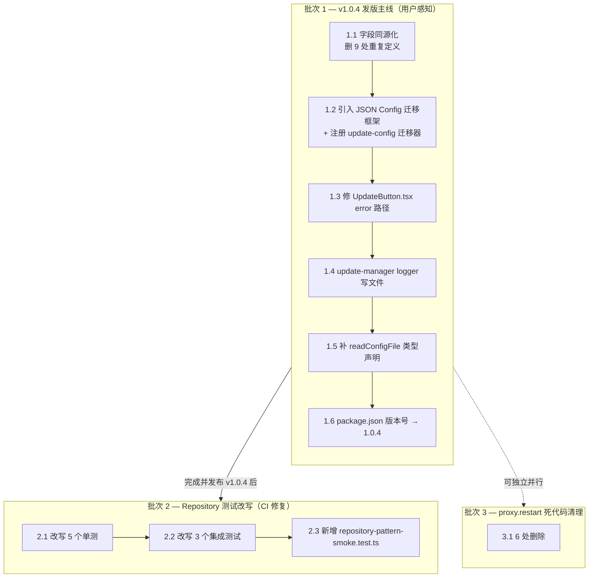
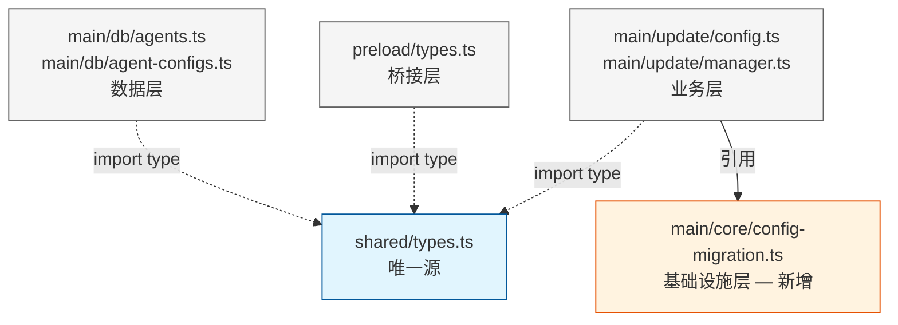
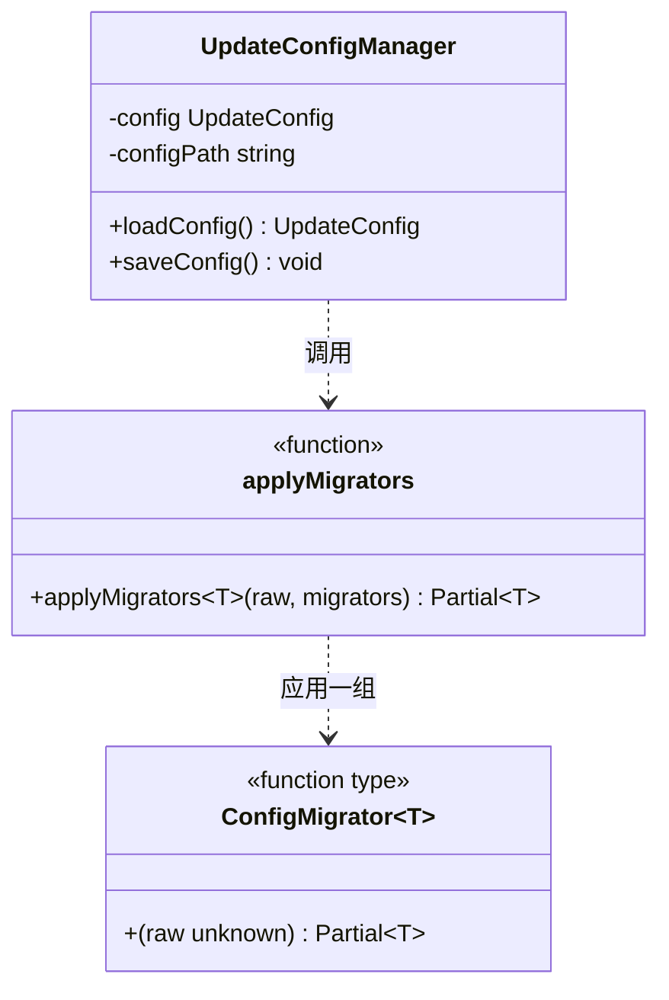
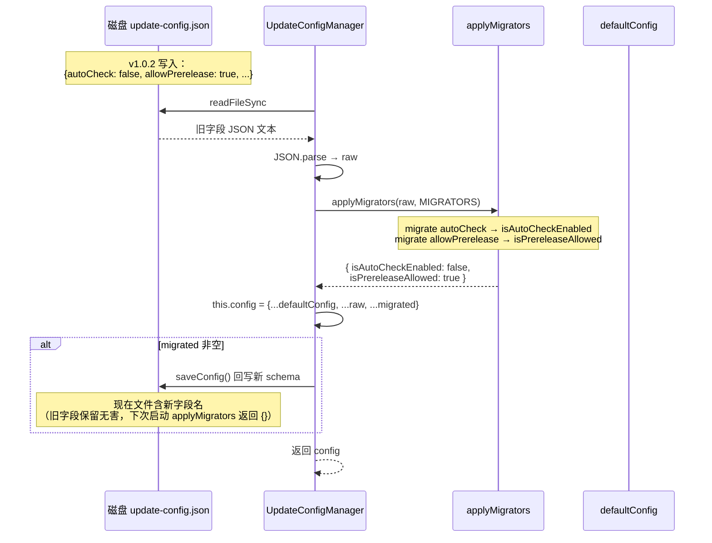
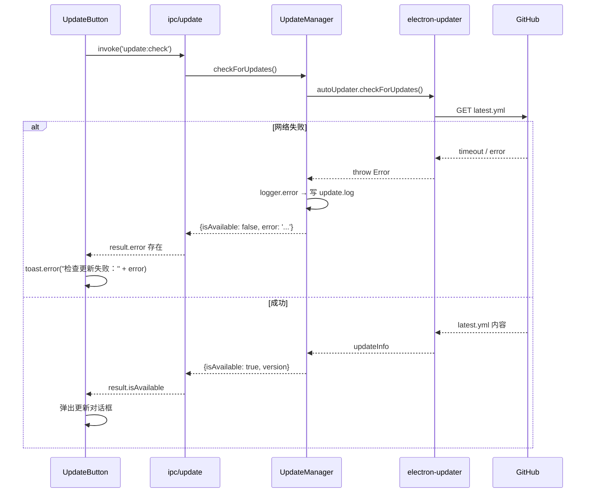
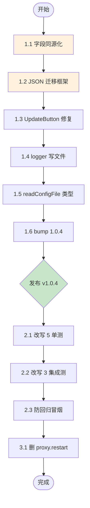

# 重构遗留字段漂移修复 — 设计文档

**日期**：2026-06-13
**状态**：草稿 — 待用户审批
**关联 BUG**：在线更新 v1.0.2 → v1.0.3 检测失败，深层原因为多处 interface 重复定义导致字段漂移
**关联 commits**：`06c9b78`（命名规范统一）、`7e022a9`（Repository 模式重构）

---

## 1. 背景与问题陈述

### 1.1 用户报告

v1.0.2 安装版用户点击"检查更新"，提示"当前已是最新版本"，但 GitHub 已发布 v1.0.3。

### 1.2 系统化调试发现的根因链

| 层级 | 问题 | 证据 |
|------|------|------|
| **观测性** | `update-manager` logger 仅输出 stdout，packaged Electron 用户永远看不到 | `%APPDATA%/llm-gateway/` 下无任何 `.log` 文件 |
| **UI** | `UpdateButton.tsx` 把 `result.error` 路径误判为"最新版本" | 网络/反序列化任何错误都被掩盖 |
| **持久化字段漂移** | `update-config.json` 磁盘字段名为 `autoCheck`/`allowPrerelease`，但 TS interface 重命名为 `isAutoCheckEnabled`/`isPrereleaseAllowed`，无迁移 | 实测磁盘文件内容验证 |
| **架构根因** | `UpdateConfig` interface 在 `shared/types.ts` 和 `main/update/config.ts` **重复定义**，重命名时只改了一处 | 工作流扫描确认 |

### 1.3 全仓扫描的扩散结果

派工作流扫描 shared/types.ts 中 20 个 interface 在全仓的重复定义情况，发现 **9 处违规**：

| # | interface | 文件 | 行号 | 与 shared 字段是否不同？ |
|---|-----------|------|------|------------------------|
| 1 | `UpdateCheckResult` | `src/main/update/manager.ts` | 9 | 否（字段相同） |
| 2 | `UpdateConfig` | `src/main/update/config.ts` | 9 | 否（字段相同） |
| 3 | `CreateAgentInput` | `src/preload/types.ts` | 28 | 否（字段相同） |
| 4 | `CreateAgentInput` | `src/main/db/agents.ts` | 32 | 否（字段相同） |
| 5 | `UpdateAgentInput` | `src/main/db/agents.ts` | ~42 | 否（字段相同） |
| 6 | `CreateAgentConfigInput` | `src/preload/types.ts` | 43 | 否（字段相同） |
| 7 | `CreateAgentConfigInput` | `src/main/db/agent-configs.ts` | 32 | 否（字段相同） |
| 8 | `UpdateAgentConfigInput` | `src/preload/types.ts` | 50 | 否（字段相同） |
| 9 | `SwitchConfigInput` | `src/preload/types.ts` | 55 | 否（字段相同） |

> "否"= 该重复定义的字段集合与 `shared/types.ts` 中标准定义完全一致（仅 JSDoc 可能不同）

幸运点：9 处违规中所有字段当前都与 shared 一致。但它们违反了项目铁律：

> 核心实体基础接口只在 `shared/types.ts` 定义，各层通过 type alias 派生，**禁止重新定义同名 interface**

下次再有任何字段重命名都可能复现"在线更新失效"这类灾难。

### 1.4 同时发现的遗留问题（非字段漂移）

- **Repository 重构后 5+3 个测试文件 import 失效** — `npm run test:backend` import 阶段崩溃，CI 已断
- **`agents.readConfigFile` 类型声明缺失** — `tsc -p tsconfig.web.json --noEmit` 报 TS2339
- **`proxy.restart` 死代码** — 三层暴露但零调用方（已 grep 验证）

---

## 2. 设计目标

| 目标 | 验证方式 |
|------|---------|
| G1. 修复 v1.0.2 用户的"检查更新永远说已是最新"BUG | v1.0.4 安装后，挂 VPN 点检查更新，能识别到 v1.0.5（届时） |
| G2. 消除 9 处违规的 interface 重复定义，回归 shared 单源 | 全仓 grep `interface (UpdateConfig\|...)` 仅 shared/types.ts 命中 |
| G3. 建立轻量 JSON 配置迁移框架，防止下次字段漂移再爆 | 新加入 JSON 配置时按相同 pattern 注册 migrator 即可 |
| G4. 恢复 `npm run test:backend` 通过 | CI 全绿 |
| G5. 修复 `tsc -p tsconfig.web.json --noEmit` TS2339 | typecheck 通过 |
| G6. 清理 `proxy.restart` 死代码 | 6 处删除后全仓 grep 仅剩零命中 |
| G7. 给运维诊断手段：`update-manager` 日志写文件 | `%APPDATA%/llm-gateway/logs/update.log` 存在并可读，包含完整链路时间戳/级别/模块/消息。预期文件大小：每次"检查更新"操作约写入 5-10 行，每行 ~200 字节，正常使用日均 < 10KB；不实现自动滚动，长期累积可控（短时间内不会写满磁盘）。Release Notes 须告知用户日志位置以协助诊断 |

---

## 3. 架构设计

### 3.1 总览（修复批次划分）



> **批次依赖关系说明**：批次 1 是 v1.0.4 发版主线，必须最先完成。批次 2（CI 修复）和批次 3（死代码清理）都不阻塞批次 1，但建议在 v1.0.4 发布后再做，避免改动堆叠影响发版稳定性。批次 2 与批次 3 之间可并行。

### 3.2 模块边界与依赖方向

遵循 `backend/30-layered-architecture.md` 的分层规则。新增的 `core/config-migration.ts` 属于基础设施层（最底层）。



✅ 依赖方向合规：
- `core/` 不依赖 `domains/`、`db/`、`ipc/`、`proxy/`（基础设施层最底）
- `update/` 业务层可引用 `core/`
- `preload/` 仅引用 `shared/` 类型
- `db/` 不依赖 `domains/`、`proxy/`、`ipc/`

---

## 4. 契约与接口

### 4.1 共享类型（无新增）

本设计不新增 shared 类型，仅消除重复定义。9 处重复定义全部回归到 `src/shared/types.ts` 已有的标准定义。

### 4.2 新增接口：JSON 配置迁移框架



> 说明：`ConfigMigrator<T>` 实际是 type alias（函数类型别名），Mermaid classDiagram 无原生支持，用 `<<function type>>` 标识其语义。

**类型定义（即将写入 `src/main/core/config-migration.ts`）：**

```typescript
/**
 * JSON 配置迁移器：将旧字段映射为新字段，幂等
 * @param raw - JSON.parse 后的原始对象
 * @returns 仅包含被迁移字段的部分对象，未触发迁移返回 {}
 */
export type ConfigMigrator<T> = (raw: unknown) => Partial<T>

/**
 * 顺序应用一组迁移器，后者覆盖前者
 * @param raw - 原始配置对象
 * @param migrators - 迁移器数组
 * @returns 合并后的迁移结果
 */
export function applyMigrators<T>(
  raw: unknown,
  migrators: ConfigMigrator<T>[]
): Partial<T>
```

### 4.3 修改接口：`UpdateConfigManager.loadConfig`

签名不变 `loadConfig(): UpdateConfig`，行为变化：

| 阶段 | 旧行为 | 新行为 |
|------|--------|--------|
| 1 | `const raw = JSON.parse(data)` | 同 |
| 2 | `{ ...defaultConfig, ...raw }` 直接合并 | **先调 `applyMigrators(raw, MIGRATORS)`** 得到 `migrated` |
| 3 | 赋值 `this.config` | `this.config = { ...defaultConfig, ...raw, ...migrated }` |
| 4 | 直接 return | **若 `Object.keys(migrated).length > 0`，调用 `saveConfig()` 回写新 schema** |

> 变量命名约定：本文档全程使用 `raw` 表示 `JSON.parse(data)` 后的原始对象、`migrated` 表示迁移后的字段补丁、`config` 表示最终合并结果。第 5.1 节数据流图与此章节命名一致。

### 4.4 修改接口：`UpdateButton.handleCheck`

```typescript
/**
 * 点击"检查更新"按钮的处理函数
 * @returns Promise<void>，不返回数据，副作用为 toast 通知或调用 onUpdateAvailable
 */
const handleCheck = async (): Promise<void> => {
  try {
    const result: UpdateCheckResult = await checkUpdate.mutateAsync()
    // 优先识别 error：网络失败、上游不可达等
    if (result.error) {
      toast.error(`检查更新失败：${result.error}`)
      return
    }
    if (result.isAvailable && result.version) {
      onUpdateAvailable?.(result.version)
    } else {
      toast.info('当前已是最新版本')
    }
  } catch (e) {
    toast.error(`检查更新失败：${e instanceof Error ? e.message : '未知错误'}`)
  }
}
```

### 4.5 修改接口：`UpdateManager` 内部 logger

```typescript
// 旧
const logger = createLogger('update-manager')

// 新（在 constructor 内构造，确保 app.getPath 已 ready）
this.logger = createLogger('update-manager', {
  file: path.join(app.getPath('userData'), 'logs', 'update.log'),
  truncate: false  // 保留历史诊断信息
})
```

**日志格式示例**（user 视角看到的 update.log 行格式）：

```
[2026-06-13T14:23:45.123Z] [INFO] [update-manager] Checking for updates {"currentVersion":"1.0.4","isPackaged":true,"forceDevUpdateConfig":false}
[2026-06-13T14:23:46.456Z] [ERROR] [update-manager] Error checking for updates {"error":"connect ETIMEDOUT 140.82.112.4:443"}
[2026-06-13T14:23:46.460Z] [INFO] [update-manager] Version comparison {"currentVersion":"1.0.4","newVersion":"1.0.5"}
```

每行格式：`[ISO 时间戳] [级别] [模块] 消息 {结构化 JSON metadata}`，与 `core/logger.ts` 既有规范一致。

### 4.6 新增接口：`window.electronAPI.agents.readConfigFile`

类型声明补全（运行时已存在，仅补类型）：

```typescript
// src/renderer/lib/types.ts:158-170 中 agents 子接口添加
readConfigFile: (agentId: number) => Promise<string>
```

---

## 5. 数据流

### 5.1 update-config.json 迁移流程（关键场景）



### 5.2 检查更新链路（修复后）



---

## 6. 错误处理（按 backend/34-error-handling.md）

### 6.1 配置迁移错误（`UpdateConfigManager.loadConfig`）

| 场景 | 处理 | 错误消息格式 |
|------|------|------------|
| 文件不存在 | 返回 `defaultConfig`（已有逻辑），不报错 | — |
| `JSON.parse` 失败 | `logger.warn('loadConfig failed', { error })` + 返回 `defaultConfig` | `Failed to parse update-config: <reason>`（仅日志，不 throw） |
| migrator 内部抛异常 | 整体 try/catch 包裹 `applyMigrators` 调用，落入"JSON.parse 失败"分支处理 | `Failed to migrate update-config: <reason>`（仅日志，不 throw） |
| `saveConfig` 写盘失败 | `logger.warn('saveConfig failed', { error })`，不抛 | `Failed to save update-config: <reason>`（仅日志，不 throw） |

> 所有错误消息遵循铁律 `Failed to {action} {entity}: {reason}`，且全部仅写日志，不向上层抛异常 — 配置层失败不应阻塞应用启动。

### 6.2 UpdateButton 错误展示（`handleCheck`）

| 场景 | 用户看到 |
|------|---------|
| `result.error` 字段非空 | `toast.error("检查更新失败：${result.error}")` |
| `mutateAsync` reject（IPC 通道异常） | `toast.error("检查更新失败：${e.message}")` |
| 正常但无更新 | `toast.info("当前已是最新版本")` |

---

## 7. 测试策略（按 backend/37-testing.md + frontend/36-frontend-testing.md）

### 7.1 批次 1 测试覆盖

#### `src/main/core/__tests__/config-migration.test.ts` （新增）

| 用例 | 断言 |
|------|------|
| `applyMigrators` 空数组 | 返回 `{}` |
| `applyMigrators` 单 migrator | 应用其结果 |
| `applyMigrators` 多 migrator | 后者覆盖前者 |
| `applyMigrators` raw 非对象 | 优雅处理（迁移器自行判断） |

#### `src/main/update/__tests__/config.test.ts` （扩展）

| 用例 | 断言 | 对应错误处理场景 |
|------|------|----------------|
| 文件不存在 | 返回 `defaultConfig`，不报错 | 6.1 文件不存在 |
| 旧字段全集 `{autoCheck, allowPrerelease}` | 迁移后 `isAutoCheckEnabled`/`isPrereleaseAllowed` 取自旧字段 | — |
| 仅旧 `autoCheck` | 仅迁移该字段，`isPrereleaseAllowed` 取默认值 | — |
| 新字段直读 | 原值不变 | — |
| 新旧共存 `{autoCheck:false, isAutoCheckEnabled:true}` | **新字段优先**（结果 `true`） | — |
| 迁移触发回写 | 二次读取，磁盘文件已含新字段名 | — |
| 已迁移文件 | 不再触发回写（幂等） | — |
| 损坏 JSON | fallback 到 default，无 throw，调 logger.warn | 6.1 JSON.parse 失败 |
| migrator 内部抛异常（mock 一个抛错的 migrator 注入） | fallback 到 default，无 throw | 6.1 migrator 异常 |
| saveConfig 写盘失败（mock fs.writeFileSync throw） | logger.warn 调用，不阻塞主流程 | 6.1 saveConfig 失败 |

#### `src/main/update/__tests__/manager.test.ts` （扩展）

| 用例 | 断言 |
|------|------|
| logger file transport 路径正确 | `createLogger` 被传入 `userData/logs/update.log` |
| 已有用例 | 保持通过 |

#### `src/renderer/features/update/components/__tests__/UpdateButton.test.tsx` （扩展）

| 用例 | 断言 | 对应错误处理场景 |
|------|------|----------------|
| `result.error` 存在 | 调用 `toast.error` 并包含 error 信息 | 6.2 result.error 非空 |
| `mutateAsync` reject 抛错 | 调用 `toast.error` 并包含 e.message | 6.2 mutateAsync reject |
| `result.isAvailable=true` 有 version | 调用 `onUpdateAvailable` 回调 | — |
| `result.error=undefined && isAvailable=false` | 显示"已是最新" | 6.2 正常无更新 |

#### `src/renderer/lib/__tests__/types.test-d.ts` （新增 type-only）

| 用例 | 断言 |
|------|------|
| `Window.electronAPI.agents.readConfigFile` 类型签名 | `(agentId: number) => Promise<string>` |

### 7.2 批次 2 测试改写参照范式

参照已正确的 `src/main/db/__tests__/agents.test.ts`：

```typescript
// 改写模板
import { createXxxRepository } from '../xxx'

beforeEach(async () => {
  // 内存 SQLite + schema 初始化
  const db = await initTestDb()
  repo = createXxxRepository(db)
})

it('create + findById', async () => {
  const created = await repo.create({ ... })
  const found = await repo.findById(created.id)
  expect(found).toEqual(created)
})
```

### 7.3 批次 2 防回归冒烟

`src/main/db/__tests__/repository-pattern-smoke.test.ts` （新增）

| 用例 | 断言 |
|------|------|
| 所有 5 个 `createXxxRepository` 工厂存在 | `typeof factory === 'function'` |
| 工厂返回对象含约定方法 | `repo.list / findById / create / update / remove` 存在 |

未来任何 Repository 重构遗失 export，import 阶段即被冒烟测试捕获。

### 7.4 批次 3 测试

无新增测试。删除后跑：
- `npm run test:backend` 全绿
- `npm run test:frontend` 全绿
- `npm run lint`
- `npx tsc --noEmit`

---

## 8. 风险评估

| # | 风险点 | 缓解 |
|---|--------|------|
| R1 | 批次 1 的 1.1（删 9 处重复定义）改 5 个生产文件，diff 较大 | 每个文件独立 commit，typecheck 通过后再下一个；改完跑 `npm test && npm run lint && npx tsc --noEmit` 三件套 |
| R2 | 1.2 迁移框架的 `saveConfig()` 在 loadConfig 内同步调用，若文件锁竞争可能写失败 | 失败仅 `logger.warn`，下次启动重试；不影响主流程 |
| R3 | 1.4 logger 加 file transport，需在 `app` ready 后调用 | logger 创建延迟到 `UpdateManager` constructor 中（`app.getPath('userData')` 此时已可用） |
| R4 | 已 ship 的 v1.0.2/v1.0.3 用户无法自动获得修复 | v1.0.4 Release Notes 中明确指引手动升级一次；后续版本检查更新即恢复 |
| R5 | 批次 2 改写 5+3 个测试文件，sync→async 转换易漏 await | 改完每个文件后单独跑该文件 `npx vitest run <path>`，全绿再下一个 |
| R6 | 批次 3 删 `restartProxy` 改了 6 处文件 | 已 grep 验证零调用；删除后再 grep 一次确认零命中 |

---

## 9. 实施依赖图



**依赖说明**：
- **强依赖**：1.1 必须在 1.2 之前 — 1.2 的迁移框架会 `import type { UpdateConfig } from '../../shared/types'`，依赖统一的类型源
- **强依赖**：1.6 必须最后 — 版本号 bump 是发版前最后一步
- **弱依赖（顺序但非必须）**：1.3 / 1.4 / 1.5 三者之间无强代码依赖，但按"先修运行时 BUG（1.3）→ 加观测性（1.4）→ 修类型（1.5）"的优先级串行实施，便于每步独立验证。图中的箭头表示推荐执行顺序，可视为软串行
- 批次 2/3 与批次 1 不阻塞，但为避免改动堆叠影响 v1.0.4 发版稳定性，建议 v1.0.4 发布后再做（详见 3.1 节批次依赖说明）

---

## 10. 验收标准

### 10.1 批次 1 验收

- [ ] 全仓 `grep -E "^export interface (UpdateConfig|UpdateCheckResult|CreateAgentInput|UpdateAgentInput|CreateAgentConfigInput|UpdateAgentConfigInput|SwitchConfigInput) "` 仅 `src/shared/types.ts` 命中
- [ ] `npx tsc --noEmit` 通过
- [ ] `npm run lint` 通过
- [ ] `npm run test:frontend` 通过
- [ ] 新增 `config-migration.test.ts` 全部用例通过
- [ ] 模拟旧 `update-config.json` 文件 → 启动应用 → 二次读取磁盘验证已迁移
- [ ] `package.json` 版本号为 `1.0.4`
- [ ] 手动测试：v1.0.4 启动后，触发"检查更新"，断网状态下能看到具体错误信息

### 10.2 批次 2 验收

- [ ] `npm run test:backend` 全绿
- [ ] `repository-pattern-smoke.test.ts` 通过
- [ ] 全部 8 个测试文件无 `TypeError: createXxx is not a function`

### 10.3 批次 3 验收

- [ ] 全仓 `grep -E "(proxy\.restart|proxy:restart|restartProxy)"` 零命中
- [ ] `npm run test` 全绿
- [ ] `npx tsc --noEmit` 通过

---

## 11. 不在本设计范围

| 项 | 原因 |
|----|------|
| 数据库 schema migration 框架 | 已有 `scripts/migrate-db.mjs` 机制，本设计不触及 |
| Sentry / 错误上报系统 | 独立 SDD spec |
| 日志文件大小滚动 | 独立改进，本次仅 append + truncate=false |
| `ConversationSidebar` 配置按钮 | 工作流误报，是"未交付功能"而非 BUG |
| `localStorage` key 重命名 | 工作流验证项目无 localStorage 持久化使用 |
| 引入 `semver` 第三方库做版本比较 | 当前 `===` 比较在本场景非根因（远程 1.0.3 vs 本地 1.0.2，`===` 返回 false 是正确的）；版本比较 BUG 仅在 `1.0.10 vs 1.0.9` 等 patch 跨 9→10 场景触发，超出本次修复范围 |

---

## 12. 后续工作建议

| 项 | 时机 |
|----|------|
| 给所有 NDJSON / JSON 持久化文件加 schema version 字段 | 累积到 3 个以上 JSON 配置时再做（YAGNI） |
| ESLint 自定义规则禁止 `interface XxxEntity {}`（除 shared/types.ts） | 长期纪律保障 |
| `npm run test:backend` 在 pre-commit hook 中跑 | 防 CI 静默断网 |
| 日志文件大小滚动 | `update.log` 累积超 1MB 时考虑 |
| 引入 `semver` 库做语义化版本比较 | patch 号跨 9→10 场景出现时 |

---

## 13. 自我对照：本设计如何避免成为"新的屎山"

用户原始要求：**修复方案必须严格按 rules，避免修复方案本身变成新的屎山**。

| 屎山反模式 | 本设计的对应规避手段 |
|-----------|--------------------|
| 大杂烩 PR / 一次改 N 类不同问题 | 严格三批次拆分，每批次独立 commit + 独立验证（§3.1） |
| 在 loadConfig 里塞 inline if/else 字段映射（违反单一职责） | 抽取 `core/config-migration.ts` 通用框架，业务文件只注册 migrator（§4.2，遵循 common/05-engineering.md 单一职责） |
| 每次重命名都重写一次迁移代码 | 框架就位后，下次 JSON 配置重命名只需写一个新 `ConfigMigrator<T>` 函数注册即可（§4.2） |
| 仅修当前 BUG，留下其他 8 处架构违规继续埋雷 | 一次性修完全部 9 处 interface 重复定义，回归 shared 单源（§3.1 任务 1.1） |
| 修复缺失测试 → 下次再爆同样问题 | §7.3 新增 `repository-pattern-smoke.test.ts` 防 import 失效回归；§7.1 测试覆盖第 6 章所有 7 个错误场景 |
| 改完不验证就 commit | §3.1 每个任务后必跑 `npx tsc --noEmit && npm run lint`；§10 验收标准每批次独立 checklist |
| 引入新依赖（semver、自动迁移库等）膨胀 | §11 明确不引入 semver、不引入加密库；§4.2 框架仅 ~60 行手写代码 |
| 未经授权扩展范围 | §11 列明 6 项不在范围（数据库 schema 框架、Sentry、文件滚动、ConversationSidebar、localStorage、semver） |
| 改类型签名却不更新调用方 | §3.1 任务 1.1 删除 9 处 interface 后必跑 typecheck，TS 自动暴露所有 broken 调用方 |
| 文档与代码脱节 | 设计文档写在 `docs/superpowers/specs/`，与 `docs/ARCHITECTURE.md` 一同纳入 git；任何后续修改文档须先于代码更新 |

**项目规则覆盖核对**：

| 涉及的 rules 文件 | 本设计遵循点 |
|----------------|-------------|
| `common/00-global.md` | 命名约定（camelCase 变量、UPPER_SNAKE 常量）、JSDoc 完整性、错误消息格式 |
| `common/05-engineering.md` | 架构先行、单一职责、防御性编程（migrator 内部 try/catch）、可读性（函数 < 50 行） |
| `backend/30-layered-architecture.md` | `core/` 作为基础设施层最底；依赖方向：`update→core`、`update→shared`，无反向依赖 |
| `backend/31-domain-modeling.md` | 不影响（本次未新增 domain） |
| `backend/34-error-handling.md` | 错误消息格式 `Failed to {action} {entity}: {reason}`；配置层错误仅记日志不抛 |
| `backend/35-security.md` | 不影响（不涉及 API Key 或敏感数据） |
| `backend/36-observability.md` | 使用 `core/logger.ts`，metadata 结构化传递；新增 `update.log` 文件 transport |
| `backend/37-testing.md` | 测试文件与源文件同目录；mock 边界正确（mock fs，不 mock 内部模块） |
| `frontend/31-renderer.md` | 不影响（UpdateButton 现有结构未变，仅修 handleCheck 内部逻辑） |
| `frontend/32-component-reuse.md` | 继续使用 `toast`，不引入新 UI 库 |
| `frontend/36-frontend-testing.md` | 测试交互行为而非内部 state；使用 `userEvent` + `findByRole` |
