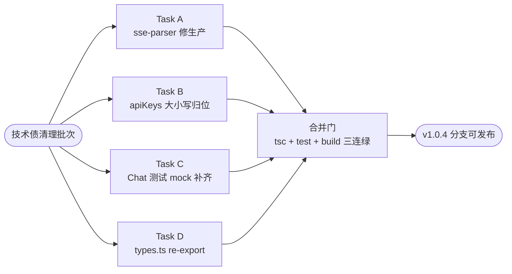
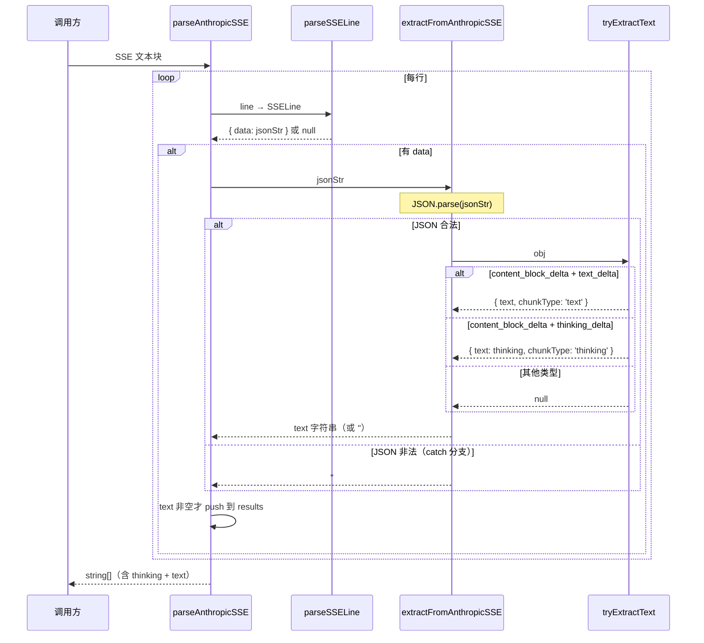
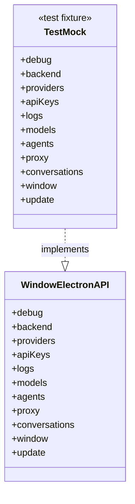
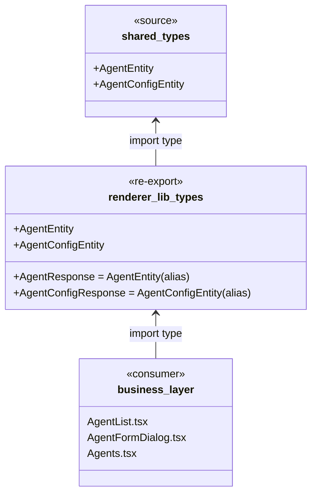

# 技术债清理批次 — 设计文档

**日期：** 2026-06-14
**范围：** 4 个独立技术债任务（sse-parser 行为对齐、apiKeys 大小写归位、Chat 测试 mock 补齐、Agent 类型 re-export）
**目标：** 消除 `npx tsc --noEmit -p tsconfig.web.json` 全部错误 + `sse-parser.test.ts` 11 个失败用例转绿。

---

## §1. 背景

### §1.1 问题来源

v1.0.4 修复批次（`fix/rename-debt-v1.0.4` 分支）完成后，遗留 4 类与本次范围无关的独立技术债：

1. **sse-parser.test.ts 11 个失败** — `b683f2c` SSE 重构遗留：`parseAnthropicSSE` 只提取 `text_delta`，丢弃 `thinking_delta`，与 JSDoc「提取所有文本片段」描述不符。
2. **apiKeys.ts vs apikeys.ts 大小写冲突** — Windows `core.ignorecase=true` 导致 git index 保留驼峰、磁盘被覆盖为小写，触发 TS1261。
3. **Chat.test.tsx mock 缺字段** — `window.electronAPI` mock 缺 `backend`、`models`、`agents` 三个子接口，触发 TS2739。
4. **AgentEntity / AgentConfigEntity 未 re-export** — `src/renderer/lib/types.ts` 仅 `import type`，未对外 re-export，触发 TS2459（3 处）。

### §1.2 用户决策记录

| 决策点 | 选项 | 用户选择 | 理由 |
|--------|------|----------|------|
| sse-parser 修复方向 | (A) 修生产同时提取 thinking+text / (B) 改测试只取 text / (C) 拆两个函数 | **(A) 修生产** | 函数 JSDoc 写「提取所有文本片段」，行为应与文档对齐；deepseek/claude reasoning 场景必须含 thinking |
| apiKeys 倒哪边 | (A) 重命名为 apiKeys.ts / (B) 改 import 为小写 | **(A) 重命名** | 项目命名规则 `.claude/rules/common/00-global.md:17`「工具 .ts 用 camelCase」 |

### §1.3 范围拆解



4 个任务文件零交集，可完全并行执行。

---

## §2. 项目类型与图表配置

| 项目类型 | 本批次类型 | Mermaid 图表 |
|---------|-----------|-------------|
| 🔧 后端工具修复（Task A） | 行为对齐 | sequenceDiagram 表达 SSE 解析流 |
| 🗂️ 重构（Task B） | 文件大小写 | 状态变化表（无图） |
| 🧪 测试修复（Task C） | mock 补齐 | classDiagram 表达 mock 契约 |
| 📐 类型修复（Task D） | re-export | classDiagram 表达类型透传 |

---

## §3. Task A — SSE Parser 行为对齐

### §3.1 现状

```typescript
// src/main/ipc/sse-parser.ts:20-23
export function extractFromAnthropicSSE(jsonStr: string): string {
  const delta = extractAnthropicDelta(jsonStr)
  return delta?.text ?? ''
}
```

`extractAnthropicDelta` 来自 `shared/sse-utils.ts`，只看 `text_delta`，丢弃 `thinking_delta`。

```typescript
// src/main/ipc/sse-parser.ts:42-49
export function tryExtractText(obj: any): { text: string; chunkType: 'thinking' | 'text' } | null {
  if (obj?.type !== 'content_block_delta') return null
  const d = obj.delta
  if (!d) return null
  if (d.type === 'text_delta' && d.text) return { text: d.text, chunkType: 'text' }
  if (d.type === 'thinking_delta' && d.thinking) return { text: d.thinking, chunkType: 'thinking' }
  return null
}
```

`tryExtractText` 已具备完整能力，但 `extractFromAnthropicSSE` 没有用它，导致 `parseAnthropicSSE` 也只有一半能力。

### §3.2 修复

`extractFromAnthropicSSE` 改为基于 `tryExtractText`：

```typescript
export function extractFromAnthropicSSE(jsonStr: string): string {
  let obj: unknown
  try {
    obj = JSON.parse(jsonStr)
  } catch {
    return ''
  }
  const result = tryExtractText(obj)
  return result?.text ?? ''
}
```

### §3.3 数据流（修复后）



### §3.4 影响面分析

| 调用点 | 影响 |
|-------|------|
| `parseAnthropicSSE` | 行为变化：现在含 thinking_delta 内容 — 这正是测试期望 |
| `useChatStream`（renderer） | 不影响 — 走的是 `tryExtractText` 路径，自带 chunkType 判定 |
| 测试 `sse-parser.test.ts` | 11 个失败转绿 |

`grep` 全仓确认 `extractFromAnthropicSSE` 调用点只有 `sse-parser.ts:59` 和 `__tests__/sse-parser.test.ts`。

### §3.5 验收标准

- `npx vitest run --config vitest.backend.config.ts src/main/ipc/__tests__/sse-parser.test.ts` 全部 27/27 通过
- `parseAnthropicSSE` 对含 `thinking_delta` 的 SSE 文本能提取出 thinking 内容
- `extractFromAnthropicSSE` 对 `text_delta` 的 JSON 行返回 text 字符串
- `extractFromAnthropicSSE` 对 `thinking_delta` 的 JSON 行返回 thinking 字符串
- 非法 JSON 仍返回 `''`

---

## §4. Task B — apiKeys.ts 大小写归位

### §4.1 现状诊断

```bash
git ls-files src/renderer/lib/queries/apiKeys.ts
# → 100644 5dd9a28d... 0  src/renderer/lib/queries/apiKeys.ts  ← git index 是驼峰

ls src/renderer/lib/queries/
# → apikeys.ts                                                  ← 磁盘是小写

git config core.ignorecase
# → true                                                         ← Windows 默认

grep -rn "queries/apiKeys" src/renderer
# → 2 处 import：useChatPage.ts 和 ApiKeys.tsx                   ← import 用驼峰
```

TypeScript 编译器在 case-insensitive 文件系统上加载文件，但 `forceConsistentCasingInFileNames` 检测到大小写不一致 → TS1261。

### §4.2 修复（两步重命名）

```bash
# Step 1: 改临时名（强制 git 识别变更，绕过 core.ignorecase）
git mv src/renderer/lib/queries/apikeys.ts src/renderer/lib/queries/apiKeys.tmp.ts

# Step 2: 临时名 → 驼峰最终名
git mv src/renderer/lib/queries/apiKeys.tmp.ts src/renderer/lib/queries/apiKeys.ts

# Verify
git ls-files src/renderer/lib/queries/ | grep -i apikey
# 预期输出： src/renderer/lib/queries/apiKeys.ts （唯一）
```

为什么需要两步：`git mv apikeys.ts apiKeys.ts` 在 `core.ignorecase=true` 下被识别为 no-op；先变成完全不同的名字（`.tmp.`），再改回去，git 才会把这两步识别为重命名 + 重命名两次操作。

### §4.3 影响面

| 项 | 修复后状态 |
|---|----------|
| 磁盘文件 | `apiKeys.ts` |
| git index | `apiKeys.ts` |
| import 路径（2 处） | `'@/lib/queries/apiKeys'` 已是驼峰，无需改 |
| Vite 解析 | 不受影响（运行时已 import 成功） |
| TS 编译 | TS1261 消除 |

### §4.4 验收标准

- `git ls-files | grep -i "lib/queries/apikey"` 仅输出 `src/renderer/lib/queries/apiKeys.ts`（驼峰）
- `node -e "console.log(require('fs').readdirSync('src/renderer/lib/queries'))"` 列表中含 `apiKeys.ts`，无 `apikeys.ts`
- `npx tsc --noEmit -p tsconfig.web.json` 不再报 TS1261
- `npm run dev` / `npm run build` 不引入新错误

### §4.5 命名规则参照

| 文件类型 | 命名 | 来源规则 |
|---------|------|---------|
| 工具/数据 `.ts` | camelCase | `.claude/rules/common/00-global.md:17` |
| 组件 `.tsx` | PascalCase | 同上 |

`apiKeys.ts` 属于「工具/数据」类，使用 camelCase 与 `modelMappings.ts`、`agents.ts`、`conversations.ts` 等同目录文件一致。

---

## §5. Task C — Chat.test.tsx mock 补齐

### §5.1 现状

`src/renderer/pages/__tests__/Chat.test.tsx:61-90` 给 `window.electronAPI` 赋值，但漏了 3 个子接口：`backend`、`models`、`agents`。

TS2739 报错指出 mock 类型不满足 `Window['electronAPI']`：
```
Type '{ debug; providers; apiKeys; logs; proxy; conversations; window; update }'
is missing the following properties from type '{ debug; backend; providers; ...; agents; update }':
backend, models, agents
```

### §5.2 修复

补齐 3 个子接口（按 `src/renderer/lib/types.ts:90-170` 接口签名）：

```typescript
window.electronAPI = {
  debug: { log: vi.fn() },
  backend: {
    isReady: vi.fn().mockResolvedValue(true),
    onReady: vi.fn().mockReturnValue(() => {}),
  },
  providers: { /* 既有 */ },
  apiKeys: { /* 既有 */ },
  logs: { /* 既有 */ },
  models: {
    list: vi.fn().mockResolvedValue([]),
    mapping: {
      find: vi.fn().mockResolvedValue(null),
      list: vi.fn().mockResolvedValue([]),
      create: vi.fn(),
      update: vi.fn(),
      delete: vi.fn(),
    },
  },
  agents: {
    list: vi.fn().mockResolvedValue([]),
    get: vi.fn(),
    create: vi.fn(),
    update: vi.fn(),
    delete: vi.fn(),
    listConfigs: vi.fn().mockResolvedValue([]),
    getConfig: vi.fn(),
    createConfig: vi.fn(),
    updateConfig: vi.fn(),
    deleteConfig: vi.fn(),
    readConfigFile: vi.fn().mockResolvedValue(''),
    switchConfig: vi.fn(),
  },
  proxy: { /* 既有 */ },
  conversations: { /* 既有 */ },
  window: { /* 既有 */ },
  update: { /* 既有 */ },
}
```

### §5.3 类型契约



### §5.4 影响面

| 项 | 影响 |
|---|----|
| 21 个 Chat 测试用例 | 行为不变（mock 默认返回值不被业务读取）|
| TS 类型检查 | TS2739 消除 |

### §5.5 验收标准

- `npx tsc --noEmit -p tsconfig.web.json` 不再报 Chat.test.tsx 的 TS2739
- `npm run test:frontend -- --run src/renderer/pages/__tests__/Chat.test.tsx` 全部通过（既有用例数不减少）
- mock 字段顺序与 `Window['electronAPI']` 接口声明顺序一致（便于阅读对照）

---

## §6. Task D — types.ts re-export Agent 实体

### §6.1 现状

```typescript
// src/renderer/lib/types.ts:8-12（下方代码片段中 // ... 注释表示其他既有字段省略，非真实 TS 语法）
import type {
  ProviderEntity, ApiKeyEntity, LogDebugInfo, // ...其他类型省略
  AgentEntity, AgentConfigEntity,             // ← 仅本地 import，未对外 export
  ModelMapping, ModelInfo,
} from '../../shared/types'

/** 向后兼容别名 */
export type AgentResponse = AgentEntity
export type AgentConfigResponse = AgentConfigEntity
```

`AgentEntity` 和 `AgentConfigEntity` 仅本地 `import type` 使用，未对外 `export type`。但 `features/agent/components/AgentList.tsx`、`AgentFormDialog.tsx`、`pages/Agents.tsx` 期望从 `@/lib/types` 直接 import 这两个类型 → TS2459（3 处报错）。

### §6.2 修复

```typescript
// 下方代码片段中 // ... 注释表示其他既有字段省略，非真实 TS 语法
import type {
  ProviderEntity, ApiKeyEntity, LogDebugInfo, // ...其他类型省略
  AgentEntity, AgentConfigEntity,
  // ...其他类型省略
} from '../../shared/types'

/** Agent 实体类型（从 shared 透传给 renderer 业务层） */
export type { AgentEntity, AgentConfigEntity }

/** 向后兼容别名 */
export type AgentResponse = AgentEntity
export type AgentConfigResponse = AgentConfigEntity
```

### §6.3 类型透传契约



### §6.4 为什么保留 alias

`.claude/rules/common/05-engineering.md`「向后兼容：接口变更必须考虑已有调用方」。

`grep` 全仓发现 `AgentResponse` / `AgentConfigResponse` 在 features/agent、preload/types.ts 等多处使用，删除会触发广泛 import 修改。本批次范围内只补 re-export，不动 alias，避免越界。

### §6.5 验收标准

- `npx tsc --noEmit -p tsconfig.web.json` 不再报 TS2459（`AgentEntity` / `AgentConfigEntity` 相关）
- `import type { AgentEntity, AgentConfigEntity } from '@/lib/types'` 能正常解析
- 既有 `AgentResponse` / `AgentConfigResponse` 调用点不受影响

---

## §7. 错误处理

| 风险 | 触发条件 | 应对 |
|-----|---------|-----|
| Task A 改 `extractFromAnthropicSSE` 触发其他模块行为变化 | 其他模块依赖「丢弃 thinking」语义 | 全仓 `grep extractFromAnthropicSSE` 已确认仅 `sse-parser.ts:59` 和测试调用 |
| Task B 重命名后 import 仍小写 | grep 不彻底 | `tsc --noEmit -p tsconfig.web.json` 强制门控 |
| Task C 字段对齐错误 | 漏字段 / 类型不匹配 | tsc 严格类型推导即报错 |
| Task D 引入循环导入 | 不可能（仅新增 export 子集） | tsc 路径检测 |

---

## §8. 测试策略

| 任务 | 测试形态 | 验证手段 |
|-----|---------|---------|
| Task A | 利用现有 11 个失败用例 | `npx vitest run --config vitest.backend.config.ts src/main/ipc/__tests__/sse-parser.test.ts` |
| Task B | 类型检查 | `npx tsc --noEmit -p tsconfig.web.json` |
| Task C | 利用现有 21 个 Chat 用例 | `npm run test:frontend -- --run src/renderer/pages/__tests__/Chat.test.tsx` |
| Task D | 类型检查 | `npx tsc --noEmit -p tsconfig.web.json` |

**最终合并门（所有任务完成后）：**
```bash
npm test                                            # 全量测试绿
npx tsc --noEmit                                    # 主 tsc 0 错误
npx tsc --noEmit -p tsconfig.web.json               # web tsc 0 错误（关键）
npm run lint                                        # 0 errors
npm run build                                       # main/preload/renderer 三产物完整
```

---

## §9. 契约与接口

本批次**不引入新跨模块契约**：

- Task A：函数签名 `extractFromAnthropicSSE(jsonStr: string): string` 不变，仅行为对齐 JSDoc
- Task B：纯文件重命名，无 API 变化
- Task C：纯测试 mock，无生产代码变化
- Task D：纯类型 re-export，无运行时变化

```mermaid
classDiagram
    class extractFromAnthropicSSE {
        <<unchanged signature>>
        (jsonStr: string) string
    }
    class tryExtractText {
        <<unchanged>>
        (obj) result | null
    }
    class parseAnthropicSSE {
        <<unchanged signature>>
        (sseText: string) string[]
    }
    extractFromAnthropicSSE --> tryExtractText : 修复后调用
    parseAnthropicSSE --> extractFromAnthropicSSE : 既有调用
```

---

## §10. 验收标准（汇总）

### §10.1 自动化指标

- [ ] `npx vitest run --config vitest.backend.config.ts src/main/ipc/__tests__/sse-parser.test.ts` → 27/27 通过
- [ ] `npm run test:frontend -- --run src/renderer/pages/__tests__/Chat.test.tsx` → 通过
- [ ] `npm test` → 后端 + 前端全绿
- [ ] `npx tsc --noEmit` → 0 错误
- [ ] `npx tsc --noEmit -p tsconfig.web.json` → 0 错误（关键 — 当前有 7 处 TS2459 + 1 处 TS1261 + 1 处 TS2739）
- [ ] `npm run lint` → 0 errors
- [ ] `npm run build` → main / preload / renderer 三产物完整

### §10.2 人工验证

- [ ] `git ls-files | grep -i "queries/apikey"` 仅返回 `src/renderer/lib/queries/apiKeys.ts`
- [ ] 在 Windows 与非 Windows 系统 `git pull` 后磁盘文件名一致
- [ ] Agent 业务页面（Agents、AgentList、AgentFormDialog）能正常 import 类型并运行

---

## §11. 执行分层

```
L0（4 任务全并行）:
  ├── Task A: src/main/ipc/sse-parser.ts
  ├── Task B: src/renderer/lib/queries/apikeys.ts → apiKeys.ts
  ├── Task C: src/renderer/pages/__tests__/Chat.test.tsx
  └── Task D: src/renderer/lib/types.ts

L1（合并验证）:
  └── 全量门控（npm test + tsc + lint + build）
```

文件零交集 → 4 任务可完全并行。

---

## §12. 反「拉屎山」自审

| 风险 | 自审结论 |
|------|---------|
| 是否扩展超出本批次范围？ | ❌ 否。每个任务严格只动一个文件，不顺手重构 |
| 是否破坏既有 API？ | ❌ 否。函数签名、类型 alias 全部保留 |
| 是否违反项目规则？ | ❌ 否。Task B 严格按 `common/00-global.md` camelCase；Task D 保留 alias 符合 `common/05-engineering.md` 向后兼容 |
| 是否引入新依赖？ | ❌ 否 |
| 是否引入新概念/抽象？ | ❌ 否。Task A 复用既有 `tryExtractText`；Task D 仅 re-export 既有类型 |
| 测试覆盖是否完整？ | ✅ 是。Task A/C 利用既有用例，Task B/D 由 tsc 强制覆盖 |
| 是否能在不读其他任务的情况下独立实施？ | ✅ 是。文件零交集，输入/输出/验收标准完全独立 |

---

## §13. 文件清单

```
新增（无）

修改：
  src/main/ipc/sse-parser.ts                           # Task A
  src/renderer/lib/queries/apikeys.ts → apiKeys.ts     # Task B（git mv 两步）
  src/renderer/pages/__tests__/Chat.test.tsx           # Task C
  src/renderer/lib/types.ts                            # Task D

删除（无）
```

---

## §14. 后续不在本批次的事项

本批次目标达成即闭环（`tsconfig.web.json` 全绿 + sse-parser 测试转绿）。以下为可选的后续独立任务（不在当前范围）：

- 删除 `AgentResponse` / `AgentConfigResponse` 别名 → 独立任务
- 统一 SSE 解析器到 `shared/sse-utils.ts`（消除 `tryExtractText` 与 `extractAnthropicDelta` 双源）→ 独立任务
