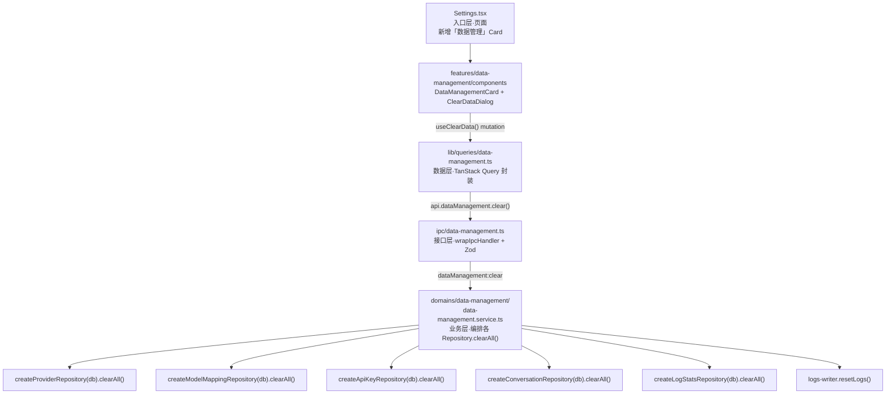
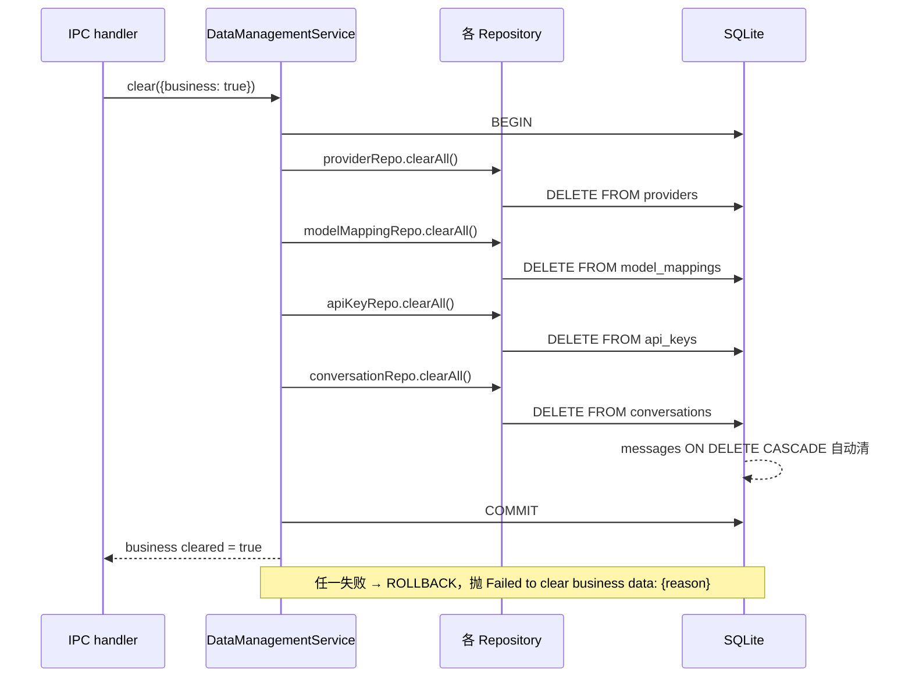
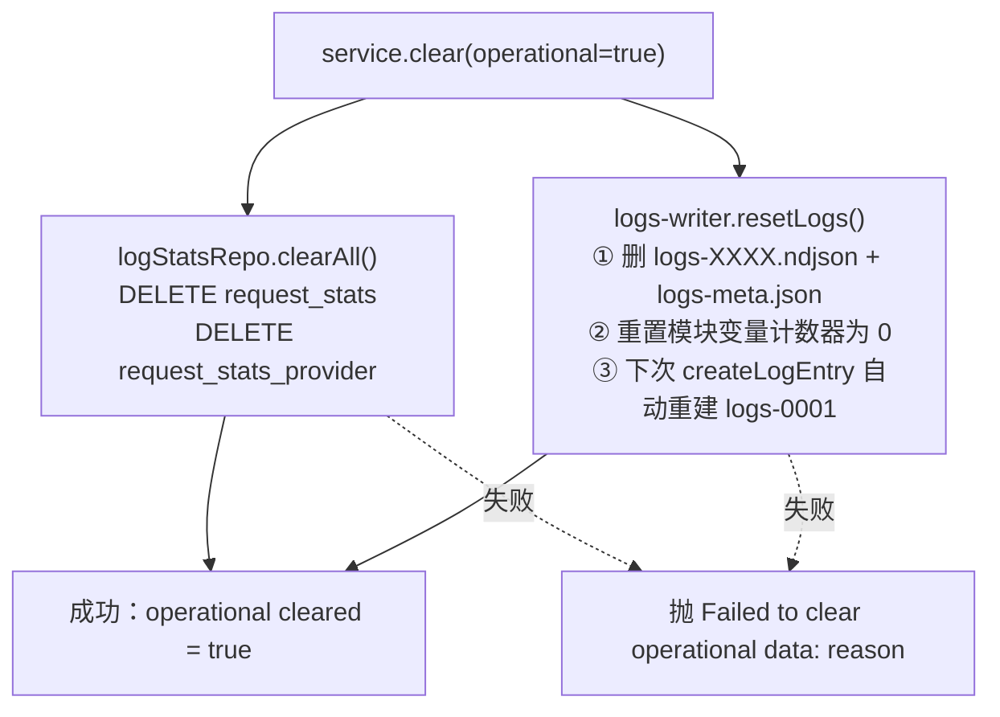
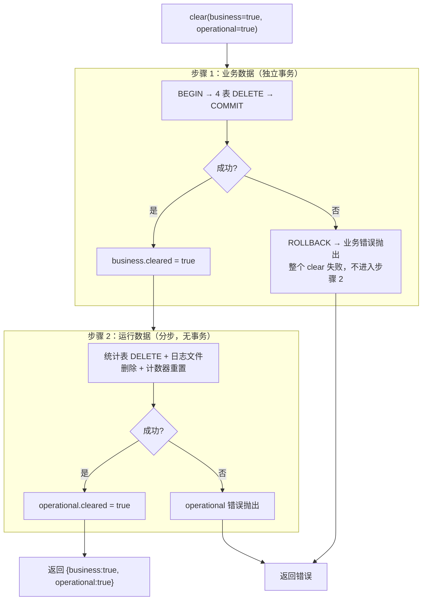
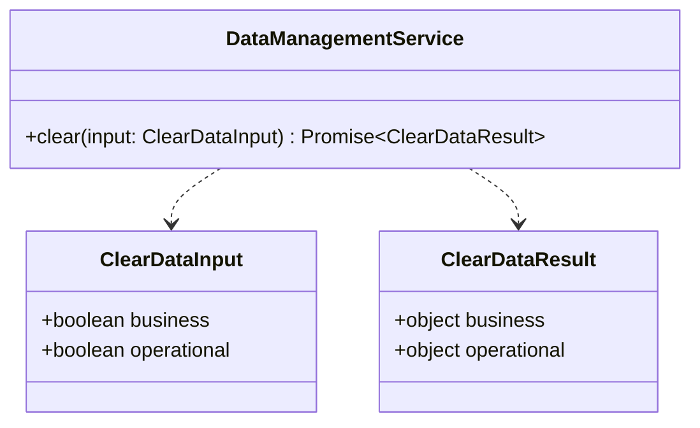

# 设置页一键清空数据（按模块勾选）— 设计文档

- **日期**：2026-06-18
- **状态**：待审查
- **类型**：全栈新功能（入口层页面 + 数据层 + 业务层 + 接口层 + 共享层）

## 1. 背景与目标

### 1.1 现状

LLM Gateway 的数据分散在两类存储：

| 存储 | 模块 | 表/文件 | 特性 |
|------|------|---------|------|
| SQLite | 供应商配置 | `providers` | 含上游 API Key |
| SQLite | 模型映射 | `model_mappings` | source→target 路由规则 |
| SQLite | API 密钥 | `api_keys` | 本地认证（SHA-256 哈希 + 明文留存用于转发） |
| SQLite | Agent 配置 | `agents` + `agent_configs` | 含 7 个**内置 Agent**，级联删除 |
| SQLite | 对话历史 | `conversations` + `messages` | `ON DELETE CASCADE` 级联 |
| SQLite | 统计数据 | `request_stats` + `request_stats_provider` | 预聚合表，每小时一行 |
| NDJSON | 请求日志 | `logs-XXXX.ndjson` + `logs-meta.json` | 500 行/文件、最多 20 文件轮转 |

现有各 Repository 仅有 `remove(id)` 单条删除，**无任何"清空全部"能力**，也无重置/清空 IPC handler。Settings 页当前仅含"自动更新"与"关于我们"两个 Card。

### 1.2 目标

在 Settings 页新增"数据管理"区块，允许用户按模块勾选后一键清空对应数据，用于排查问题、重置环境或释放空间。**操作不可恢复**，故采用强确认机制。

### 1.3 非目标（YAGNI）

- 不做数据导出/备份（用户需自行在清空前导出）
- 不做按时间范围清空（仅全量清空某一类）
- 不做回收站/软删除
- 不重置应用偏好设置（如自动更新开关），偏好属于独立本地存储

## 2. 需求决策记录（用户确认）

| 决策点 | 选择 | 理由 |
|--------|------|------|
| 模块粒度 | 粗粒度·2 分组 | 业务数据 / 运行数据；最简形态，符合"按模块勾选"最小可用语义 |
| Agent 处理 | 保留全部 Agent | Agent 作为应用配置模板，与业务数据分离；内置预设不应被清空 |
| 确认强度 | 输入文字强确认 | 业务数据含不可恢复的 API Key 与对话，需最强防误操作 |

## 3. 模块划分

```
┌─ 业务数据 (business) ─────────────────────────────┐
│  供应商配置 providers                              │
│  模型映射   model_mappings                         │
│  API 密钥   api_keys                               │
│  对话历史   conversations + messages(级联)          │
│  （Agent 配置 agents/agent_configs — 完全不动）     │
└───────────────────────────────────────────────────┘

┌─ 运行数据 (operational) ──────────────────────────┐
│  请求日志   logs-XXXX.ndjson + logs-meta.json      │
│  统计数据   request_stats + request_stats_provider │
└───────────────────────────────────────────────────┘
```

## 4. 总体架构

新增 `data-management` domain 作为跨聚合根的清空编排器，严格遵循五层架构与依赖注入链。



### 分层合规性

- 业务层（`domains/data-management/`）只导入 `db/`（Repository）与 `core/`，不碰 `proxy/`、不导入 hono
- 接口层（`ipc/data-management.ts`）不直接导入 `db/` 的业务函数（仅 type-only 导入 Database 类型 + 注入 db 实例），校验在入口 Zod `.parse()` 完成
- 前端走 `lib/queries/data-management.ts` 封装，组件内不直接 `window.electronAPI.invoke`
- 全部符合 `.claude/rules/backend/30-layered-architecture.md` 导入路径约束

## 5. 数据流

### 5.1 业务数据清空（单事务，4 表原子）



### 5.2 运行数据清空（统计表 + 日志文件）



> 运行数据分步执行**无事务包裹**：统计表 DELETE 与日志文件删除任一步失败即抛错，已执行步骤不回滚（统计表已清但日志文件删除失败属可接受中间态，用户重试即可）。

> `resetLogs()` 必须同时重置 `logs-writer.ts` 的模块级状态变量（`currentFileNumber` / `currentFileLines` / `entryCounter`），否则清空后首次写入会用错误的序号。删除文件后无需重建 `logs-0001.ndjson`，`createLogEntry` 内部已有"首次写入初始化"逻辑。

### 5.3 组合输入执行策略（business 与 operational 同时为 true）

当用户同时勾选业务数据与运行数据时，**先业务后运行、各自独立**，不合并为一个事务：



**部分成功语义**：

| 业务结果 | 运行结果 | 整体行为 | 返回值 |
|---------|---------|---------|--------|
| 成功 | 成功 | 成功 | `{business:{cleared:true}, operational:{cleared:true}}` |
| 成功 | 失败 | **部分成功** | 抛 `Failed to clear operational data: {reason}`，但**业务数据已实际清空**（不可回滚）。错误消息需提示用户"业务数据已清空，运行数据清空失败，请重试" |
| 失败 | —（不执行） | 失败 | 抛 `Failed to clear business data: {reason}`，运行数据未动 |

> 设计权衡：业务数据先执行且一旦失败即终止，保证最敏感的 API Key/对话数据要么全清要么不动；运行数据后执行，因其失败影响小（日志/统计可重建），允许部分成功并提示重试。不做跨 SQLite 与文件系统的大事务（sql.js 无 XA，文件操作无法纳入 DB 事务）。

## 6. 前端组件

### 6.1 页面集成

在 `Settings.tsx` 的"关于我们"Card **之前**插入"数据管理"Card。

### 6.2 UI 布局

```
┌──────────────────────────────────────────────┐
│ ⚠ 数据管理                                      │
│ 清空应用数据，操作不可恢复，请谨慎               │
│                                              │
│ ☐ 业务数据                                     │
│   供应商配置 · 模型映射 · API 密钥 · 对话历史     │
│   (Agent 配置将保留)                           │
│                                              │
│ ☐ 运行数据                                     │
│   请求日志 · 统计数据                           │
│                                              │
│                       [清空选中数据] (destructive)
│                       未勾选任一项时 disabled
└──────────────────────────────────────────────┘
```

### 6.3 强确认弹窗（AlertDialog）

```
┌──────────────────────────────────────────────┐
│ 确认清空数据                                    │
│                                              │
│ 即将清空：业务数据、运行数据                      │
│ 此操作不可恢复！                                │
│                                              │
│ 请输入"清空"以确认：                            │
│ [____________________] (Input)                │
│                                              │
│                  [取消]  [确认清空]            │
│              (确认按钮：输入 === "清空" 时启用)  │
└──────────────────────────────────────────────┘
```

- 使用 `components/ui/alert-dialog`（Radix AlertDialog），**禁止** `confirm()`/`alert()`（无边框窗口焦点夺走问题，见 `frontend/32-component-reuse.md`）
- 勾选项用 `components/ui/checkbox`
- 清空按钮用 `components/ui/button` 的 `destructive` 变体
- 触发按钮用 `motion.div` 包裹 Card 实现 hover/press 动画（不用 `motion.button` 替代 Button）

### 6.4 清空后处理

```
成功 → toast.success('已清空选中数据')
     → queryClient.invalidateQueries() 失效被清空模块的缓存
       （清空业务数据：providers / modelMappings / apiKeys / conversations）
       （清空运行数据：logs / stats）
       agents 不清空故不失效
     → 各页面查询自动重新拉取，展示空态 EmptyState
失败 → toast.error(getErrorMessage(e))
```

## 7. 错误处理

| 层 | 策略 | 错误消息格式 |
|----|------|-------------|
| 业务层（service） | 业务数据事务失败 → ROLLBACK + 抛 | `Failed to clear business data: {reason}` |
| 业务层（service） | 运行数据分步执行，失败抛 | `Failed to clear operational data: {reason}` |
| 接口层（IPC） | `wrapIpcHandler` 统一捕获 ZodError | `Invalid input: {field}: {message}` |
| 接口层（IPC） | 业务错误透传消息 | `{ error: '...' }` |
| Schema | `clearDataSchema` 校验 | `business`/`operational` 均 boolean，至少一个 true |
| 前端 | `mutation.onError` | `toast.error(getErrorMessage(e))`，不静默吞错 |

错误分类与传播规则遵循 `.claude/rules/backend/34-error-handling.md`。

## 8. 契约与接口

### 8.1 共享类型（`shared/types.ts` 派生）

```typescript
/** 清空数据输入 */
interface ClearDataInput {
  /** 业务数据：供应商/模型映射/API密钥/对话历史 */
  business: boolean
  /** 运行数据：请求日志/统计数据 */
  operational: boolean
}

/** 清空数据结果 */
interface ClearDataResult {
  business: { cleared: boolean }
  operational: { cleared: boolean }
}
```

### 8.2 模块接口



### 8.3 IPC 通道

| Channel | Request | Response |
|---------|---------|----------|
| `dataManagement:clear` | `ClearDataInput` | `ClearDataResult` |

通道命名遵循 `{domain}:{action}` 单数域规则（`backend/32-interface-contracts.md`）。

### 8.4 Repository 新增方法

| Repository / 模块 | 新增方法签名 | 实现 |
|------------|------------|------|
| `createProviderRepository(db)` | `clearAll(): Promise<void>` | `DELETE FROM providers` |
| `createModelMappingRepository(db)` | `clearAll(): Promise<void>` | `DELETE FROM model_mappings` |
| `createApiKeyRepository(db)` | `clearAll(): Promise<void>` | `DELETE FROM api_keys` |
| `createConversationRepository(db)` | `clearAll(): Promise<void>` | `DELETE FROM conversations`（messages 级联） |
| `createLogStatsRepository(db)` | `clearAll(): Promise<void>` | `DELETE FROM request_stats; DELETE FROM request_stats_provider` |
| `logs-writer.ts`（裸函数模块，非 Repository） | `resetLogs(): void` | 删全部 NDJSON + meta + 重置模块计数器（详见 8.5） |

### 8.5 logs-writer 新增导出

```typescript
/**
 * 清空全部 NDJSON 日志并重置计数器状态。
 * 1. 删除所有 logs-XXXX.ndjson 文件 + logs-meta.json
 * 2. 重置模块变量 currentFileNumber / currentFileLines / entryCounter 为 0
 * 3. 不重建空文件，下次 createLogEntry 自动初始化 logs-0001.ndjson
 */
export function resetLogs(): void
```

### 8.6 service 工厂签名

```typescript
import { resetLogs } from '../../db/logs-writer'

export function createDataManagementService(db: Database) {
  const providerRepo = createProviderRepository(db)
  const modelMappingRepo = createModelMappingRepository(db)
  const apiKeyRepo = createApiKeyRepository(db)
  const conversationRepo = createConversationRepository(db)
  const logStatsRepo = createLogStatsRepository(db)
  return {
    async clear(input: ClearDataInput): Promise<ClearDataResult> {
      // 业务数据：先执行，独立事务，失败即终止（见 5.3）
      // 运行数据：后执行，分步无事务，调 logStatsRepo.clearAll() + resetLogs()
      // ... ...
    }
  }
}
export type DataManagementService = ReturnType<typeof createDataManagementService>
```

> `resetLogs()` 是 `logs-writer.ts` 导出的裸函数（非 Repository，符合 NDJSON 模块豁免，见 `backend/33-data-access.md`），service 直接 import 调用，无需注入。service 不实例化 agentRepo——Agent 表不参与清空，service 内无需引用。

## 9. 测试策略（TDD）

| 类型 | 文件 | 覆盖 |
|------|------|------|
| Schema 单测 | `data-management.schema.test.ts` | 两个 false 拒绝；非 boolean 拒绝；合法输入接受 |
| Service 单测 | `data-management.service.test.ts` | `clear({business:true})` 清空 4 表 + 验证 `agents`/`agent_configs` 行数**不变**；`clear({operational:true})` 清统计表 + 删日志文件 + meta 重置；业务事务中途失败 → ROLLBACK（验证部分清空不残留）；组合输入 `clear({business:true,operational:true})` 验证先业务后运行；运行数据失败时业务已清空（部分成功语义） |

> **测试手段说明**：验证"agents 行数不变"时，测试自行创建 `createAgentRepository(db)`（或直接 `db.prepare('SELECT COUNT(*)...')`）查询，**不通过被测的 service**（service 不持有 agentRepo）。属测试内的只读断言，不违反"测试不导入非本 domain service"规则——仅用 Repository 查询，不调用其 service 方法。
| 组件测试 | `ClearDataDialog.test.tsx` | 未勾选→按钮禁用；勾选→弹窗；输入非"清空"→确认禁用；输入"清空"→确认启用→点击→成功 toast + 缓存失效 |

测试约定遵循 `.claude/rules/backend/37-testing.md` 与 `.claude/rules/frontend/36-frontend-testing.md`：用内存数据库（不 mock DB）、`screen.findByRole`/`findByText` 语义查询、mock `window.electronAPI`。

## 10. 安全考量

- 清空操作经文字强确认，防误触
- API Key 清空时连同明文 `key` 字段一并删除（`api_keys.key` 存有明文用于转发），不残留
- 不在日志中记录被清空的具体 API Key 内容（仅记录"已清空 N 条"计数）
- 清空属本地操作，不涉及网络/外部服务
- **在途连接不受影响**：清空 API 密钥仅删除数据库行，不主动断开正在进行的代理请求（SSE 长连接）。在途请求使用其发起时已读取的密钥完成本次转发，结束后下次请求因密钥不存在而失败——属预期行为，无需特殊处理
- `resetLogs()` 并发约束：清空操作由用户在 UI 手动触发，与代理请求写入日志存在理论竞态。实际场景下用户清空前通常无活跃请求；若清空瞬间恰有请求写入，可能出现一条日志写入到已重置的序号——可接受（日志非关键数据，下次轮转自愈）。实现中**不加锁**，保持简单

## 11. 涉及文件清单

### 新增

| 文件 | 层 | 说明 |
|------|----|------|
| `src/main/domains/data-management/data-management.service.ts` | 业务层 | 清空编排 |
| `src/main/domains/data-management/data-management.schema.ts` | 业务层 | Zod 校验 |
| `src/main/domains/data-management/data-management.types.ts` | 业务层 | 类型派生 |
| `src/main/domains/data-management/__tests__/*.test.ts` | — | service + schema 单测 |
| `src/main/ipc/data-management.ts` | 接口层 | IPC handler |
| `src/renderer/features/data-management/components/DataManagementCard.tsx` | 表现层 | 勾选 + 触发按钮 |
| `src/renderer/features/data-management/components/ClearDataDialog.tsx` | 表现层 | 强确认弹窗 |
| `src/renderer/features/data-management/components/__tests__/*.test.tsx` | — | 组件测试 |
| `src/renderer/lib/queries/data-management.ts` | 数据层 | TanStack Query 封装 |

### 修改

| 文件 | 改动 |
|------|------|
| `src/main/db/providers.ts` | 加 `clearAll()` |
| `src/main/db/model-mappings.ts` | 加 `clearAll()` |
| `src/main/db/api-keys.ts` | 加 `clearAll()` |
| `src/main/db/conversations.ts` | 加 `clearAll()` |
| `src/main/db/logs-stats.ts` | 加 `clearAll()`（此文件已存在，含 `createLogStatsRepository`，见 `src/main/db/logs-stats.ts`） |
| `src/main/db/logs-writer.ts` | 加 `resetLogs()` 导出 |
| `src/main/ipc/index.ts` | 注册 `registerDataManagementHandlers(db)` |
| `src/renderer/lib/ipc.ts` | 加 `dataManagement.clear` API |
| `src/renderer/pages/Settings.tsx` | 插入"数据管理"Card |
| `src/shared/types.ts` | 派生 `ClearDataInput` / `ClearDataResult` |

## 12. 实施顺序（供 writing-plans 参考）

1. **契约先行**：`shared/types.ts` 派生类型 + 各 Repository `clearAll()` + `logs-writer.resetLogs()`（数据层，可并行）
2. **业务层**：`data-management` domain service + schema（依赖契约）
3. **接口层**：`ipc/data-management.ts` + 注册（依赖 service）
4. **数据层前端**：`lib/queries/data-management.ts` + `lib/ipc.ts`（依赖 IPC 通道）
5. **表现层**：`DataManagementCard` + `ClearDataDialog` + Settings 集成（依赖 query 封装）
6. **TDD**：每步 RED→GREEN→REFACTOR，service/schema/组件测试同步

修改 `shared/types.ts` 后必须运行 `npx tsc --noEmit` 确认无编译错误。
