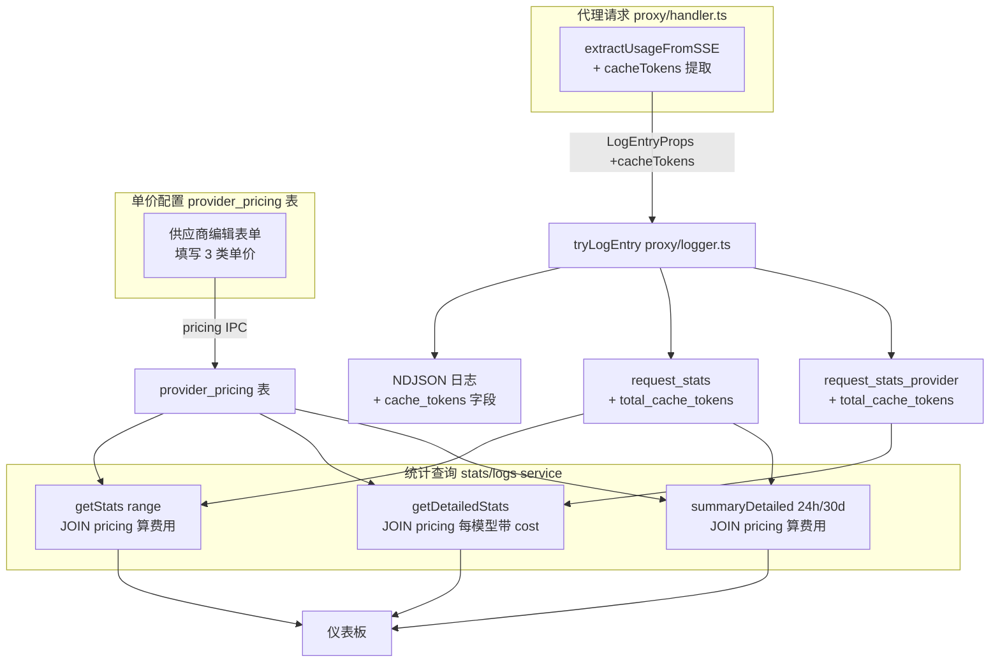
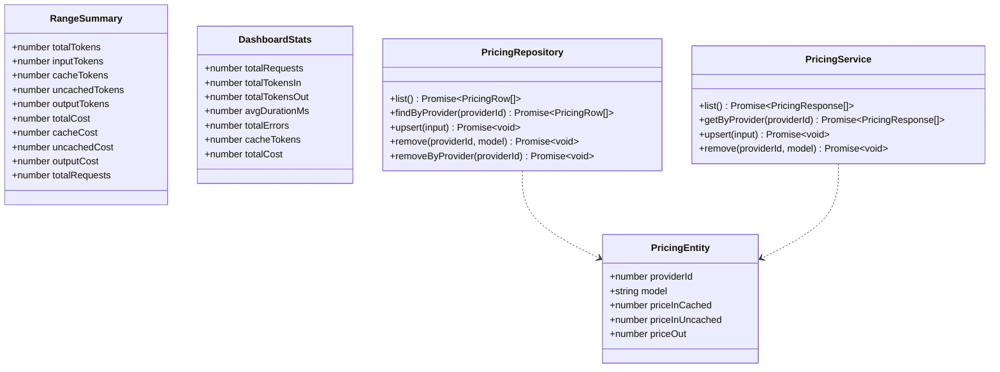
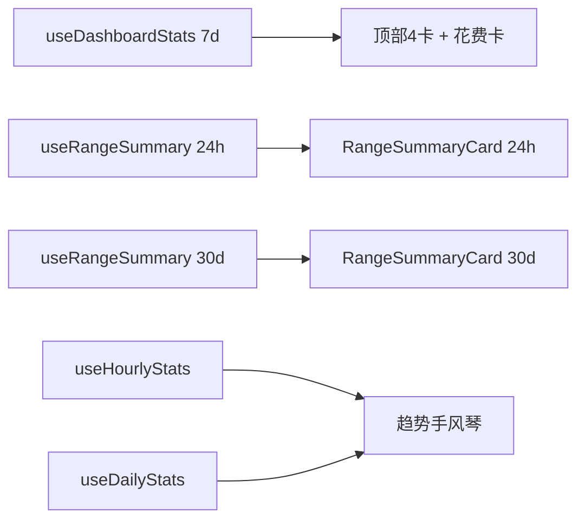

# 仪表板费用配置与缓存 Token 统计 — 设计文档

- 日期：2026-06-18
- 主题：仪表板增加费用配置（百万 tokens 输入缓存命中 / 输入缓存未命中 / 输出）与费用计算；供应商标记卡片改为近 7 天花费；新增 24 小时与近 30 天的 token（总/缓存/非缓存）、花费（总/缓存/非缓存）、次数汇总。

## 1. 背景与现状

### 1.1 现状关键事实
- **缓存 token 完全未采集**：`src/main/proxy/logger.ts` 的 `extractUsageFromSSE` 仅提取 `tokensIn`/`tokensOut`，未提取 OpenAI 的 `usage.prompt_tokens_details.cached_tokens` 与 Anthropic 的 `usage.cache_read_input_tokens`。NDJSON 日志行、`request_stats`、`request_stats_provider` 表均无缓存字段。
- **费用概念不存在**：无单价配置、无费用计算、无供应商费用字段。
- **供应商标记卡片**（`DashboardStatsGrid` 第 3 张）当前显示 `activeProviders / totalProviders`。
- **统计接口**：`StatsService.summary(range)` 提供 7d 概览；`LogsService.detailedStats('24h'|'30d')` 按供应商×模型×时间点聚合；无"24h/30d 全局汇总"接口。
- 统计采用 SQLite 预聚合表（`request_stats` / `request_stats_provider`），NDJSON 仅存详细日志，查询走预聚合表避免全量扫描。

### 1.2 决策记录
| 决策 | 选择 | 理由 |
|------|------|------|
| 单价层级 | 按供应商+模型 | 同供应商不同模型价位差异大（如 opus vs haiku），需精确到模型 |
| 单价存储 | 独立 `provider_pricing` 表 | 与 providers 解耦，查询/更新/清空独立，符合 Repository 模式 |
| 缓存口径 | 二分法（命中/未命中） | 简化计算；Anthropic `cache_creation` 归入"未命中输入"，OpenAI 仅有 `cached_tokens` |
| 历史数据 | 不回填，仅新数据 | 老统计表无缓存列，老 NDJSON 未存原始 SSE 无法重提；符合预聚合不回溯现状 |
| 费用计算位置 | 后端 SQL JOIN 实时算 | 单价变更历史查询自动重算，无需存储费用；逻辑集中 |
| 单价 UI 入口 | 供应商编辑表单内 | 与供应商强绑定，配置集中 |
| 仪表板布局 | 顶部卡片 + 24h/30d 汇总分区 | 保留 7d 概览，新增两区间汇总，趋势手风琴保留 |

## 2. 整体架构与数据流



### 2.1 缓存 token 采集口径（二分法）
- **Anthropic**：`cache_tokens = usage.cache_read_input_tokens`（缓存命中）。`cache_creation_input_tokens` 归入"非缓存输入"，不单独计费。
- **OpenAI**：`cache_tokens = usage.prompt_tokens_details.cached_tokens`。
- **非缓存输入** = `tokensIn - cache_tokens`（费用计算时推算，不单独存列）。

### 2.2 费用计算公式
```
某模型某时段费用 =
  (cache_tokens × price_in_cached   / 1_000_000)
+ (MAX(0, tokens_in - cache_tokens) × price_in_uncached / 1_000_000)
+ (tokens_out × price_out / 1_000_000)
```
- 缺单价记录（模型未配置）→ 该模型费用按 0，token 照常统计。
- `cache_tokens > tokens_in` 异常 → 非缓存输入 clamp 到 0。

## 3. 数据模型

### 3.1 表结构变更

两张预聚合表各新增 1 列（`db/schema.ts` 建新库时含此列；旧库走迁移脚本 ALTER）：

```sql
-- request_stats（全局，按小时聚合）
ALTER TABLE request_stats ADD COLUMN total_cache_tokens INTEGER NOT NULL DEFAULT 0;
-- 复合主键不变 (stat_date, stat_hour)

-- request_stats_provider（按供应商+模型，按小时聚合）
ALTER TABLE request_stats_provider ADD COLUMN total_cache_tokens INTEGER NOT NULL DEFAULT 0;
-- 复合主键不变 (stat_date, stat_hour, provider_id, model)
```

新增 `provider_pricing` 表：

```sql
CREATE TABLE IF NOT EXISTS provider_pricing (
  provider_id        INTEGER NOT NULL,
  model              TEXT NOT NULL,
  price_in_cached    REAL NOT NULL DEFAULT 0,  -- 元/百万tokens 缓存命中输入
  price_in_uncached  REAL NOT NULL DEFAULT 0,  -- 元/百万tokens 缓存未命中输入
  price_out          REAL NOT NULL DEFAULT 0,  -- 元/百万tokens 输出
  created_at TEXT NOT NULL DEFAULT (datetime('now')),
  updated_at TEXT NOT NULL DEFAULT (datetime('now')),
  PRIMARY KEY (provider_id, model),
  FOREIGN KEY (provider_id) REFERENCES providers(id) ON DELETE CASCADE
);
```

### 3.2 NDJSON 日志行扩展
`src/main/db/logs-writer.ts` 的 `createLogEntry` 新增 `cache_tokens` 字段：

```json
{ "id": 1, "...": "...", "tokens_in": 100, "tokens_out": 50, "cache_tokens": 30, "duration_ms": 1200, "...": "..." }
```

### 3.3 迁移
- `db/schema.ts` 的 `createTables` 中：`provider_pricing` 直接 `CREATE TABLE IF NOT EXISTS`；两张老表的新列因 `CREATE TABLE IF NOT EXISTS` 不会给已存在表加列，需迁移脚本。
- 新增 `scripts/migrate-pricing-cache.mjs`：对两张表执行 `ALTER TABLE ... ADD COLUMN total_cache_tokens ...`，幂等（先查 `pragma_table_info` 判断列是否存在再 ALTER）。风格与现有 `scripts/migrate-db.mjs` 一致。

## 4. 模块拆分与契约

### 4.1 类型关系



### 4.2 新增 domain：`pricing`

```
src/main/domains/pricing/
├── pricing.types.ts     # PricingRow / PricingInput / PricingResponse
├── pricing.schema.ts    # Zod: createPricingSchema / updatePricingSchema
└── pricing.service.ts   # createPricingService(db) — CRUD

src/main/db/provider-pricing.ts   # createPricingRepository(db) — Repository 工厂
```

| 接口 | 方法签名 | 说明 |
|------|---------|------|
| `PricingRepository` | `list(): Promise<PricingRow[]>` | 列全部单价 |
| | `findByProvider(providerId): Promise<PricingRow[]>` | 按供应商查 |
| | `upsert(input): Promise<void>` | 写入/更新单条 (provider_id, model) |
| | `remove(providerId, model): Promise<void>` | 删单条 |
| | `removeByProvider(providerId): Promise<void>` | 删供应商下全部（级联辅助） |
| `PricingService` | `list(): Promise<PricingResponse[]>` | 转换后返回 |
| | `getByProvider(providerId): Promise<PricingResponse[]>` | 供应商表单回填 |
| | `upsert(input): Promise<void>` | 入口校验后委派 |
| | `remove(providerId, model): Promise<void>` | |

### 4.3 stats domain 扩展

费用计算是业务规则（缺单价归 0、clamp 非缓存、单价实时算），归属业务层，SQL JOIN 一次聚合。

| 接口 | 方法签名 | 说明 |
|------|---------|------|
| `StatsService.summary` | `(query) => Promise<StatsResponse>` | 7d 概览（现 +cacheTokens +totalCost） |
| `StatsService` 新增 `summaryDetailed` | `(range: '24h'\|'30d') => Promise<RangeSummary>` | 新：24h/30d 全局汇总 |
| `LogsService.detailedStats` | 扩展返回，每模型带 `cost` + `cacheTokens` | 供应商×模型×时间点 |

### 4.4 共享类型（`shared/types.ts` 新增）

```typescript
/** 单价记录（跨进程） */
export interface PricingEntity {
  providerId: number
  model: string
  priceInCached: number
  priceInUncached: number
  priceOut: number
}

/** 范围汇总（24h / 30d 全局） */
export interface RangeSummary {
  // token 维度（输入侧三分，输出侧单列，与费用维度对称）
  totalTokens: number        // = inputTokens + outputTokens（输入+输出总和）
  inputTokens: number        // 输入 token 总量（= cacheTokens + uncachedTokens）
  cacheTokens: number        // 缓存命中输入
  uncachedTokens: number     // 非缓存输入（inputTokens - cacheTokens，clamp ≥ 0）
  outputTokens: number       // 输出 token 总量
  // 费用维度（与 token 三分对应：缓存输入 / 非缓存输入 / 输出）
  totalCost: number          // = cacheCost + uncachedCost + outputCost
  cacheCost: number          // 缓存命中输入费用
  uncachedCost: number       // 非缓存输入费用
  outputCost: number         // 输出费用
  totalRequests: number      // 请求次数
}
```

**口径说明**：token 维度采用"输入三分（缓存/非缓存）+ 输出单列"结构，与费用维度一一对应（`cacheCost`↔`cacheTokens`、`uncachedCost`↔`uncachedTokens`、`outputCost`↔`outputTokens`）。`totalTokens = inputTokens + outputTokens`。SQL 聚合时 `inputTokens = SUM(tokens_in)`、`cacheTokens = SUM(cache_tokens)`、`uncachedTokens = MAX(0, SUM(tokens_in) - SUM(cache_tokens))`、`outputTokens = SUM(tokens_out)`。

`DashboardStats` 扩展：`+cacheTokens` `+totalCost`。

### 4.5 IPC 通道契约

| Channel | Method | 请求 | 响应 |
|---------|--------|------|------|
| `pricing:list` | IPC | — | `PricingEntity[]` |
| `pricing:getByProvider` | IPC | `providerId` | `PricingEntity[]` |
| `pricing:upsert` | IPC | `PricingInput` | `void` |
| `pricing:delete` | IPC | `{providerId, model}` | `void` |
| `logs:rangeSummary` | IPC（新） | `'24h'\|'30d'` | `RangeSummary` |

通道命名：单数域 `pricing`（单实体 CRUD）+ 复数聚合 `logs:rangeSummary`（跨实体聚合，归 logs 域），遵循 `backend/32-interface-contracts.md`。

**调用链**：`logs:rangeSummary` handler 注册在 `ipc/logs.ts`，内部调用 `statsService.summaryDetailed(range)`（费用计算与统计聚合归属 stats service，IPC 通道归属 logs 域仅为命名一致，不经过 logsService 转发）。

## 5. 前端 UI

### 5.1 供应商编辑表单 — 单价配置区

`ProviderFormDialog` 内模型列表下方新增"费用配置"区。每个模型一行 3 个单价输入（缓存命中/未命中/输出），单位标注"元/百万tokens"。

```
┌─ 供应商编辑表单 ─────────────────────────────────┐
│ 名称 / 类型 / baseUrl / apiKey / models[]        │
├─ 费用配置（元/百万tokens）──────────────────────┤
│ 模型           缓存命中   未命中    输出          │
│ claude-3-opus  [  3.15] [ 15.75] [ 75.00]        │
│ gpt-4o         [  1.25] [  2.50] [ 10.00]        │
│ （仅对已填 models 的行展示，复用 Input 组件）     │
└──────────────────────────────────────────────────┘
```

- 提交时把每行 upsert 到 `provider_pricing`（与 provider create/update 同一保存流程）。
- 复用现有 `Input`、`Label` 共享组件，不引入新 UI 库。

### 5.2 仪表板布局

```
┌─ 仪表盘 ──────────────────────────────────────────────────────┐
│ [近7日请求] [近7日Token消耗] [近7天花费] [近7日平均延迟]      │  ← 顶部4卡（第3张改花费）
├──────────────────────────────────────────────────────────────┤
│ 近 24 小时                                                    │
│ Token: [总] [缓存] [非缓存] [输出]   花费: [总] [缓存] [非缓存] [输出] │
│ 次数: N                                                      │
├──────────────────────────────────────────────────────────────┤
│ 近 30 天    （同上结构）                                      │
├──────────────────────────────────────────────────────────────┤
│ 近 30 日时间趋势（手风琴，保留）                              │
└──────────────────────────────────────────────────────────────┘
```

### 5.3 新增组件

```
src/renderer/features/dashboard/components/
└── RangeSummaryCard.tsx   ← 24h/30d 单区块（token 4列 + 费用 4列 + 次数）
```

- token 4 列：总 / 缓存 / 非缓存 / 输出；费用 4 列：总 / 缓存 / 非缓存 / 输出。
- `Dashboard.tsx` 用两次 `<RangeSummaryCard range="24h" />` `<RangeSummaryCard range="30d" />`。
- `DashboardStatsGrid` 第 3 张卡 `供应商标记` → `近 7 天花费`（用 7d summary 的 `totalCost`）。原"供应商标记"（启用/总数）信息不再单独展示，供应商数量可在供应商管理页查看。
- queries：新增 `useRangeSummary(range)`，queryKey `['stats','rangeSummary',range]`。



## 6. 错误处理

- **缓存提取异常**：`extractUsageFromSSE` 解析失败时 `cacheTokens = 0`，沿用现有"跳过格式错误 JSON"策略，不中断主流程（日志尽力而为）。
- **缺单价**：JOIN 不到 `provider_pricing` 行 → 该模型费用按 0，`COALESCE(price, 0)`，token 照常统计。不抛业务错误（"未配置单价"是正常态）。
- **cacheTokens > tokensIn 异常**：费用计算 SQL 中用 `MAX(0, tokens_in - cache_tokens)` clamp 非缓存输入，防御性处理脏数据。
- **pricing CRUD**：遵循现有 `wrapIpcHandler` + Zod `.parse()`；业务错误格式 `Failed to {action} pricing: {reason}`。供应商删除时级联清理其 pricing（FK `ON DELETE CASCADE` + Repository `removeByProvider` 双保险）。
- **迁移脚本失败**：`ALTER TABLE ADD COLUMN` 幂等（先查 `pragma_table_info`），失败仅 `logger.warn` 不阻断启动（列默认 0，老数据照常统计，仅缺缓存维度）。

## 7. 测试策略（TDD）

| 层 | 测试文件 | 覆盖点 |
|----|---------|--------|
| 数据层 | `db/__tests__/provider-pricing.test.ts` | Repository CRUD、级联删除、upsert 幂等 |
| | `db/__tests__/logs-stats.test.ts`（扩展） | `updateRequestStats`/`updateProviderStats` 写入 cache_tokens、getStats JOIN pricing 算费用、缺单价归 0、clamp |
| 业务层 | `domains/pricing/__tests__/pricing.service.test.ts` | service CRUD 委派、字段转换 |
| | `domains/stats/__tests__/stats.service.test.ts` | summary 带 cacheTokens+cost、summaryDetailed 24h/30d、缺单价场景 |
| | `domains/logs/__tests__/logs.service.test.ts`（扩展） | detailedStats 每模型带 cost |
| 代理层 | `proxy/__tests__/logger.test.ts`（扩展） | `extractUsageFromSSE` 提取 OpenAI cached_tokens、Anthropic cache_read；无缓存字段时返回 0 |
| 接口层 | `ipc/__tests__/integration.test.ts`（扩展） | pricing IPC CRUD、logs:rangeSummary |
| 迁移 | `scripts/migrate-pricing-cache` 自检 | 幂等 ALTER |
| 前端 | `features/dashboard/components/__tests__/RangeSummaryCard.test.tsx` | 渲染 token/费用/次数、加载态、空数据 |
| | `ProviderFormDialog` 测试扩展 | 单价输入与提交 upsert |

数据库测试用内存库，不 mock 数据库；代理 usage 提取用 mock SSE 文本，不发真实请求。

## 8. 影响范围

新增文件：
- `src/main/db/provider-pricing.ts`
- `src/main/domains/pricing/{pricing.types,pricing.schema,pricing.service}.ts` 及测试
- `src/main/ipc/pricing.ts`
- `src/renderer/features/dashboard/components/RangeSummaryCard.tsx` 及测试
- `scripts/migrate-pricing-cache.mjs`

修改文件：
- `src/main/db/schema.ts`（新表 + 新列声明）
- `src/main/db/logs-stats.ts`（统计写入/查询加 cache_tokens + JOIN pricing）
- `src/main/db/logs-writer.ts`（NDJSON 加 cache_tokens）
- `src/main/proxy/logger.ts`（extractUsageFromSSE 加 cacheTokens）
- `src/main/domains/stats/stats.{service,types}.ts`（summary 扩展 + summaryDetailed）
- `src/main/domains/logs/logs.{service,types}.ts`（detailedStats 带 cost）
- `src/main/ipc/{logs.ts,index.ts}`（注册 pricing + logs:rangeSummary）
- `src/shared/types.ts`（PricingEntity / RangeSummary）
- `src/preload/types.ts`、`src/renderer/lib/types.ts`、`src/preload/index.ts`（API 暴露）
- `src/renderer/lib/queries/{stats.ts,providers.ts}`（useRangeSummary + pricing queries）
- `src/renderer/pages/Dashboard.tsx`、`features/dashboard/components/DashboardStats.tsx`、`features/provider/components/ProviderFormDialog.tsx`
- `docs/ARCHITECTURE.md`（同步数据流与模块职责）

遵循铁律：`console.log` 禁用（用 logger）；单文件超 500 行拆分；`confirm/alert` 用 Radix；业务 CRUD 走 IPC；数据层 Repository 工厂；技术架构变更后更新 ARCHITECTURE.md。
