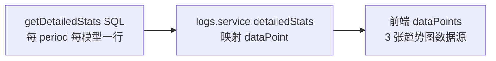
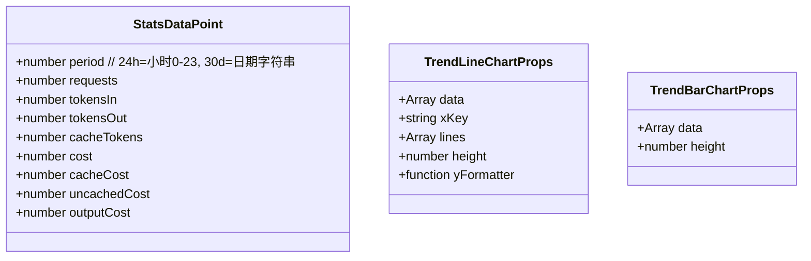
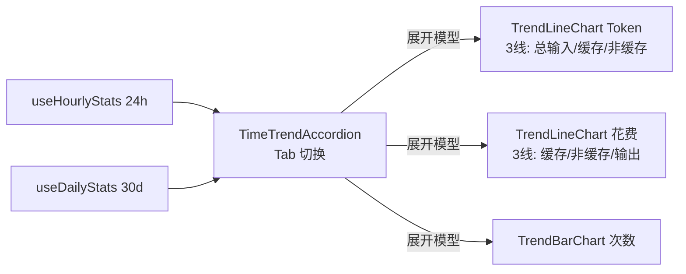

# 仪表板趋势图改造 — 设计文档

- 日期：2026-06-19
- 主题：仪表板趋势区从"单系列 token 柱/面积图"改造为"按供应商/模型分组的 3 维度趋势图"（Token / 花费 / 次数），支持 24h 与 30d Tab 切换。

## 1. 背景与现状

### 1.1 现状
- 仪表板趋势区 `TimeTrendAccordion`：按供应商→模型手风琴展开，每个模型下 2 张图——`HourlyBarChart`（24h token 柱状）+ `DailyAreaChart`（30d token 面积），均只画单系列 token。
- 顶部已有 4 卡 + 24h/30d 汇总卡（`RangeSummaryCard`，本次不动）。
- 数据接口 `logs:statsDetailed` → `getDetailedStats` 按 `provider_id + model + period` 聚合，每个 dataPoint 含 `requests/tokensIn/tokensOut/cacheTokens/cost`。

### 1.2 需求（用户确认）
两个时间跨度（24h / 30d），每个跨度下**按供应商/模型分组**（手风琴），每个模型组下 **3 张趋势图**：
1. Token 趋势：3 条线（总输入 / 缓存 / 非缓存）
2. 花费趋势：3 条线（缓存 / 非缓存 / 输出）
3. 次数趋势：柱状（requests）

24h / 30d 用 **Tab 切换**（非上下并列）。

### 1.3 数据缺口
现有 `getDetailedStats` 每个 period 只算合并 `cost`，**未拆 `cacheCost/uncachedCost/outputCost` 时序**。要支持"花费趋势 3 线"，需 SQL 扩展 3 列费用拆分。

### 1.4 决策记录
| 决策 | 选择 | 理由 |
|------|------|------|
| 趋势图形态 | 汇总卡 + 3 张趋势图 | 保留汇总卡，趋势图反映时序变化 |
| 组织维度 | 按供应商/模型分组（手风琴） | 看到每个模型的费用/趋势 |
| 24h/30d 布局 | Tab 切换 | 页面紧凑，不重复 |
| 花费趋势线 | 缓存/非缓存/输出 3 线 | 与 token 3 分对应，需扩展 SQL |
| 非缓存输入 token | 不存列，前端实时算 `tokensIn - cacheTokens` | 与 RangeSummary 口径一致，避免冗余列 |

## 2. 数据层扩展



**变更**：
- `db/logs-stats.ts` getDetailedStats：SQL SELECT 增加 3 列费用拆分（COALESCE 缺单价归 0，公式同 getRangeSummary）：
  - `cache_cost` = `SUM(total_cache_tokens) * price_in_cached / DIV`
  - `uncached_cost` = `MAX(0, SUM(total_tokens_in) - SUM(total_cache_tokens)) * price_in_uncached / DIV`
  - `output_cost` = `SUM(total_tokens_out) * price_out / DIV`
  - `cost`（保留）= 三者之和
- `logs.service.ts` detailedStats：row 类型 +3 列；model 维度累加 +3；dataPoint 透传 +3。
- 类型层 `DetailedStatsDataPoint`（后端 logs.types.ts）+ `StatsDataPoint`（前端 renderer/lib/types.ts）+3 字段。

## 3. 前端布局与组件

```
┌─ 仪表板 ──────────────────────────────────────────────┐
│ [近7日请求][近7日Token][近7天花费][近7日延迟]         │ 顶部4卡(不动)
│ [近24小时汇总卡] [近30天汇总卡]                       │ 汇总卡(不动)
├──────────────────────────────────────────────────────┤
│ 趋势分析                                              │
│ ┌─[24h] [30d]─ Tab 切换 ─────────────────────────┐   │
│ │ ▼ kimi (2 模型 · 120 次 · ¥0.05)               │   │ 手风琴按供应商
│ │   ▼ kimi-k2.7-code                             │   │
│ │     [Token 趋势 3线] [花费趋势 3线] [次数柱状]  │   │ 每模型3图
│ │   ▶ kimi-k1（折叠）                             │   │
│ │ ▶ anthropic (折叠)                              │   │
│ └────────────────────────────────────────────────┘   │
└──────────────────────────────────────────────────────┘
```

**组件拆分**：
- `TimeTrendAccordion.tsx`（改造）：顶部加 `[24h] [30d]` Tab；两个 query（useHourlyStats/useDailyStats）均预加载，Tab 仅切换显示哪个数据源；手风琴按供应商→模型展开。每模型渲染 3 张趋势图。
- `TrendLineChart.tsx`（新建）：Recharts `LineChart` 多系列通用组件。
- `TrendBarChart.tsx`（新建）：次数柱状图。
- 移除现有 `HourlyBarChart`/`DailyAreaChart` 双图结构（单系列 token，被 3 图替代）。

**状态管理**（两套独立 state）：
- Tab 选中态：`useState<'24h'|'30d'>('24h')`
- 手风琴展开态：`useState<number|null>(expandedProvider)`（按 providerId 记忆，Tab 切换时保留）

**数据映射**（每个模型 dataPoints → 3 图）：
- Token 趋势：`[{period, 总输入: tokensIn, 缓存: cacheTokens, 非缓存: tokensIn-cacheTokens}]`
- 花费趋势：`[{period, 缓存: cacheCost, 非缓存: uncachedCost, 输出: outputCost}]`
- 次数趋势：`[{period, requests}]`

## 4. 契约与接口

### 4.1 共享类型



`DetailedStatsDataPoint`（后端 logs.types.ts）与 `StatsDataPoint`（前端）同步 +3 费用字段。

### 4.2 模块接口

| 接口 | 方法签名 | 说明 |
|------|---------|------|
| `LogStatsRepository.getDetailedStats` | `(range: '24h'\|'30d') => Promise<Row[]>` | 扩展：每行 +cache_cost/uncached_cost/output_cost |
| `LogsService.detailedStats` | `(range) => Promise<DetailedStatsProvider[]>` | 扩展：dataPoint +3 费用字段 |
| `TrendLineChart`（新） | `(props: TrendLineChartProps) => JSX` | 多系列折线图 |
| `TrendBarChart`（新） | `(props: TrendBarChartProps) => JSX` | 柱状图 |
| `TimeTrendAccordion`（改造） | `(props: { hourlyStats, dailyStats, isLoading }) => JSX` | Tab + 手风琴 + 3图 |

### 4.3 数据流



### 4.4 命名约定
- 组件 PascalCase，文件 .tsx PascalCase（features 下）
- 趋势图颜色：缓存=蓝、非缓存=橙、输出=绿、总输入=灰（用主题色变量，非硬编码色值）
- period 格式：24h 显示小时(0-23)、30d 显示日期(MM-DD)

## 5. 错误处理与边界
- 缺单价模型：cacheCost/uncachedCost/outputCost 为 0（COALESCE），token 趋势正常显示，花费趋势全 0 线。
- 空 dataPoints：趋势图显示空轴 + 提示（复用 EmptyState 或图表内置空态）。
- 单 period 数据：折线退化为单点，仍渲染。
- Tab 切换时手风琴展开状态保留（按 providerId/model 记忆）。

## 6. 测试
| 层 | 测试 | 覆盖点 |
|----|------|--------|
| 数据层 | logs-stats.test.ts 扩展 | getDetailedStats 返回 cache_cost/uncached_cost/output_cost，缺单价归 0 |
| 业务层 | logs.service.test.ts 扩展 | detailedStats dataPoint 含 3 费用字段，model 累加正确 |
| 前端 | TimeTrendAccordion.test.tsx | Tab 切换 24h/30d、手风琴展开、3 图渲染、空数据 |
| | TrendLineChart.test.tsx | 多系列线渲染、空数据 |
| | TrendBarChart.test.tsx | 柱状渲染、空数据 |
| 全量 | tsc -b + npm test + lint | 无回归 |

## 7. 影响范围
修改：
- `src/main/db/logs-stats.ts`（getDetailedStats SQL +3 列）
- `src/main/domains/logs/logs.service.ts`（dataPoint 映射 +3）
- `src/main/domains/logs/logs.types.ts`（DetailedStatsDataPoint +3）
- `src/renderer/lib/types.ts`（StatsDataPoint +3）
- `src/renderer/features/dashboard/components/TimeTrendAccordion.tsx`（改造为 Tab+3图）
- 相关测试

新建：
- `src/renderer/features/dashboard/components/TrendLineChart.tsx` + 测试
- `src/renderer/features/dashboard/components/TrendBarChart.tsx` + 测试

删除：
- `HourlyBarChart`/`DailyAreaChart`（若仅 TimeTrendAccordion 使用，确认无其他引用后移除）

不动：顶部 4 卡、RangeSummaryCard 汇总卡、pricing/cache_tokens 采集链路（已修复）。
