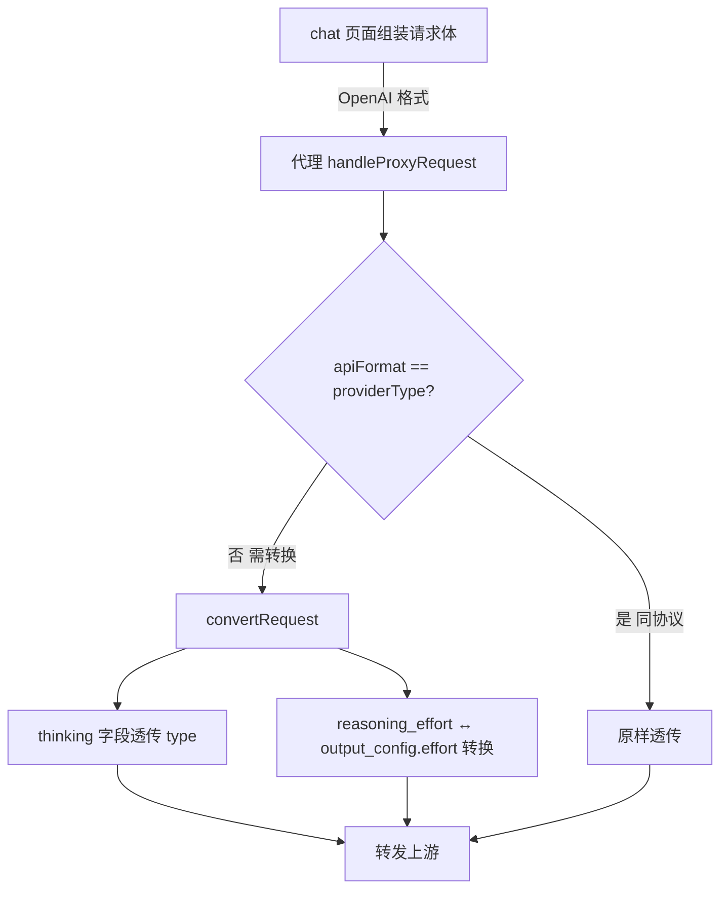
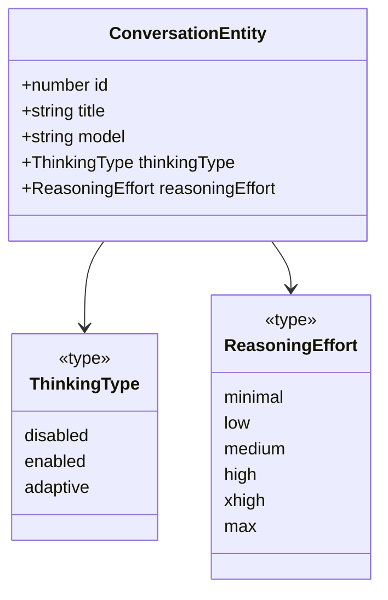

# 思考参数透传与协议转换 设计文档

> **创建日期**：2026-06-19
> **背景**：chat 页面请求 moonshot `kimi-k2.7-code`（anthropic 端点）报错 `invalid thinking: only type=enabled is allowed for this model`。排查发现根因不是缺配置，而是代理对「思考参数」的协议转换逻辑有缺陷，且 chat 页面无思考控制入口。

## 1. 问题根因

### 1.1 报错链路（proxy-debug.log 实证）

```
chat 页面 → POST /v1/chat/completions (OpenAI 格式)
  clientBody = {model, messages, stream}   ← 无任何思考参数
    ↓ 代理 OpenAI→Anthropic 转换
  convertedBody = {model, stream, max_tokens, messages}   ← 无 thinking
    ↓ 转发 moonshot anthropic 端点
  moonshot kimi-k2.7-code 强制要求 thinking:{type:'enabled'}
    ↓
  400 invalid thinking: only type=enabled is allowed for this model
```

### 1.2 两层根因

| 层 | 问题 | 性质 |
|---|---|---|
| 客户端层 | chat 页面无思考参数控制入口，请求体不含任何思考字段 | 缺功能 |
| 转换层 | `openaiToAnthropicRequest` 把 `reasoning_effort` 误转成 `thinking:{type:'enabled',budget_tokens}`（request.ts:353-356），混淆了「思考开关」与「思考强度」两个正交维度；且不处理新形态 `adaptive`/`output_config.effort` | 转换缺陷 |

### 1.3 架构定性

代理是**协议转换 + 透传**服务，**不替客户端决定是否思考**。思考是客户端语义：
- 客户端传什么思考参数，代理忠实转换成上游能接受的格式
- 客户端不传，代理不注入（纯透传）
- 代理**不配置模型标记、不生成 budget_tokens、不兜底注入**

子问题「moonshot 强制要 thinking 但客户端没传」由 chat 页面 UI 解决（用户主动开启思考），代理不参与。

## 2. 思考参数双维度模型

思考控制由两个**正交维度**组成：

```
维度1: thinking.type —— 执行方式（是否思考、怎么思考）
  枚举: 'disabled' | 'enabled' | 'adaptive'

维度2: reasoning_effort —— 强度偏好（思考投入多少）
  枚举: 'minimal' | 'low' | 'medium' | 'high' | 'xhigh' | 'max'

两维度独立，可任意组合：
  adaptive + high   ← 自适应执行 + 强度偏好 high
  enabled  + low    ← 显式启用 + 强度 low
  disabled          ← 关闭（此时 effort 无意义，不传）
```

### 2.1 跨协议对照表

| 控制维度 | OpenAI 格式 | Anthropic 格式 |
|---|---|---|
| 思考开关（执行方式） | `thinking: {type: 'disabled'\|'enabled'\|'adaptive'}`（走 extra_body） | `thinking: {type: 'disabled'\|'enabled'\|'adaptive'}` |
| 思考强度（强度偏好） | `reasoning_effort: 'minimal'\|...|'max'` | `output_config: {effort: 'minimal'\|...|'max'}` |

- `thinking` 字段跨协议**同名同结构**，直接透传 `type`
- `reasoning_effort` ↔ `output_config.effort` 跨协议**字段名转换**，值不变

## 3. 转换契约（修正现状缺陷）

### 3.1 OpenAI → Anthropic（`openaiToAnthropicRequest`）

| 客户端字段 | 上游字段 | 处理 |
|---|---|---|
| `body.thinking` | `result.thinking` | 同结构透传（含 type） |
| `body.reasoning_effort` | `result.output_config.effort` | 字段名转换，值不变 |

**删除**现状 request.ts:353-356 的 `reasoning_effort → thinking:{type:'enabled',budget_tokens}` 误转逻辑。
**删除**代理生成 `budget_tokens` 的行为（客户端要带自己带）。

### 3.2 Anthropic → OpenAI（`anthropicToOpenAIRequest`）

| 客户端字段 | 上游字段 | 处理 |
|---|---|---|
| `body.thinking` | `result.thinking` | 同结构透传 |
| `body.output_config.effort` | `result.reasoning_effort` | 字段名转换，值不变 |

**删除**现状 request.ts:580-585 的 `thinking.enabled → reasoning_effort`（按 budget_tokens 反推 low/medium/high）逻辑——这是把强度从开关反推，语义错误。改为：`thinking` 透传、`output_config.effort` 转 `reasoning_effort`，两维度各自独立处理。

### 3.3 同协议透传（from === to）

不转换，body 原样透传（含客户端带的 thinking / reasoning_effort / output_config）。

### 3.4 转换数据流



## 4. chat 页面思考设置 UI

### 4.1 UI 布局

```
┌─ 思考设置 ──────────────────────────────────────┐
│ 执行方式: ( )disabled  ( )enabled  ( )adaptive   │
│ 强度偏好: [medium ▼]                              │
│   选项: minimal / low / medium / high / xhigh / max │
│   （执行方式=disabled 时灰显，且不发送）           │
└──────────────────────────────────────────────────┘
```

- 两个独立控件，正交组合
- `disabled` 时强度选择灰显（视觉提示无效），请求体不发送任何思考参数
- `enabled`/`adaptive` 时强度可选，请求体发送 `thinking` + `reasoning_effort`

### 4.2 请求体组装规则

| 执行方式 | 强度 | 请求体附加字段 |
|---|---|---|
| disabled | （任意） | 无（不发 thinking、不发 reasoning_effort） |
| enabled | X | `thinking:{type:'enabled'}` + `reasoning_effort:'X'` |
| adaptive | X | `thinking:{type:'adaptive'}` + `reasoning_effort:'X'` |

> 注：chat 页面统一用 OpenAI 格式发请求（走 `/v1/chat/completions`），故客户端侧字段为 `thinking` + `reasoning_effort`。代理再按上游 providerType 转换。

### 4.3 持久化：按对话保存

思考设置（执行方式 + 强度）随对话保存，切对话不丢失，新建对话默认 disabled。

## 5. 数据模型变更

### 5.1 conversations 表加两列

```sql
ALTER TABLE conversations ADD COLUMN thinking_type TEXT;       -- 'disabled'|'enabled'|'adaptive'，NULL 视为 disabled
ALTER TABLE conversations ADD COLUMN reasoning_effort TEXT;    -- 'minimal'|...|'max'，NULL 视为不传
```

- nullable，旧对话默认 NULL（= disabled，向后兼容）
- 迁移走 schema 启动迁移（`db/schema.ts` 中 ALTER TABLE ... ADD COLUMN，sql.js 无 IF NOT EXISTS 时用 PRAGMA table_info 防重）

### 5.2 实体类型扩展

`shared/types.ts` 新增共享枚举与 ConversationEntity 扩展：

```typescript
/** 思考执行方式（与上游 thinking.type 对应） */
export type ThinkingType = 'disabled' | 'enabled' | 'adaptive'
/** 思考强度偏好（与 reasoning_effort / output_config.effort 对应） */
export type ReasoningEffort = 'minimal' | 'low' | 'medium' | 'high' | 'xhigh' | 'max'
```

`ConversationEntity` 增 `thinkingType?: ThinkingType`、`reasoningEffort?: ReasoningEffort`（可选，向后兼容）。各层 type alias 派生，禁止重复定义。

## 6. 契约与接口

### 6.1 共享类型（shared/types.ts）

| 类型 | 定义 | 用途 |
|---|---|---|
| `ThinkingType` | `'disabled' \| 'enabled' \| 'adaptive'` | 执行方式枚举 |
| `ReasoningEffort` | `'minimal' \| 'low' \| 'medium' \| 'high' \| 'xhigh' \| 'max'` | 强度枚举 |
| `ConversationEntity` | 增 `thinkingType?`、`reasoningEffort?` | 对话实体扩展 |

### 6.2 模块接口签名

| 模块 | 方法签名 | 说明 |
|---|---|---|
| `ConversationRepository` | `update(id, data)` 增 `thinking_type?`、`reasoning_effort?` 字段 | 数据层写入 |
| `ConversationRepository` | `create(...)` 增可选 `thinkingType`、`reasoningEffort` | 新建对话带思考设置 |
| `ConversationService` | `update(id, {thinkingType?, reasoningEffort?})` | 业务层透传 |
| `ConversationService` | `create({thinkingType?, reasoningEffort?})` | 业务层透传 |
| `convertRequest` (proxy) | 行为变更：thinking 透传 + reasoning_effort↔output_config.effort 转换 | 删除 budget_tokens 生成 |

### 6.3 IPC 契约（跨进程一致性铁律）

`conversations:update` 通道已存在（`UpdateConversationInput`），扩展两个可选字段：

| 通道 | 参数形态 | handler Zod schema |
|---|---|---|
| `conversations:update` | 对象 `{id, thinkingType?, reasoningEffort?, ...}` | `z.object({id: z.number().int(), thinkingType: z.enum(['disabled','enabled','adaptive']).optional(), reasoningEffort: z.enum(['minimal','low','medium','high','xhigh','max']).optional(), ...})` |
| `conversations:create` | 对象 `{title, model, providerId?, apiKeyId?, thinkingType?, reasoningEffort?}` | 同上扩展 |

- 参数形态对齐：preload 传对象 → handler 用 `z.object` 校验
- 字段命名统一：全程 camelCase（thinkingType / reasoningEffort），数据层映射 snake_case
- 返回类型真实：`conversations:create` 返回 `ConversationEntity`（含新字段）
- 类型同源：`ThinkingType`/`ReasoningEffort` 在 shared/types.ts 定义，preload/renderer type alias 派生

### 6.4 类型关系



## 7. 前端集成点

### 7.1 现有调用链（改造点）

```
useChatPage.handleSend → send(modelFull, messages)
  → useChatStream.send(model, messages)
    → buildRequestBody(model, messages)   ← 仅组 {model, messages, stream}
    → apiFetch('/v1/chat/completions', body)
```

### 7.2 改造后调用链

```
useChatPage（持有 thinkingType + reasoningEffort 状态）
  → send(modelFull, messages, thinkingConfig)
  → useChatStream.send(model, messages, thinkingConfig)
    → buildRequestBody(model, messages, thinkingConfig)   ← 按规则注入 thinking/reasoning_effort
    → apiFetch(...)
```

`thinkingConfig` 类型：`{thinkingType: ThinkingType, reasoningEffort: ReasoningEffort}`。

`buildRequestBody` 注入逻辑：
- `thinkingType === 'disabled'` → 不注入
- 否则 → `body.thinking = {type: thinkingType}` + `body.reasoning_effort = reasoningEffort`

### 7.3 状态管理

- `useChatPage` 增 `thinkingType` / `reasoningEffort` 状态，初值从当前对话读取
- 切对话时（`handleSelectConversation`）同步读取对话的思考设置
- 新建对话默认 `disabled` + `medium`
- 修改思考设置时调 `conversations.update` 持久化

## 8. 错误处理

- 转换层：`thinking`/`reasoning_effort`/`output_config` 字段缺失或形态不符 → 不注入该字段（防御性，不抛错），保持纯透传语义
- 上游因 thinking 形态返回 400 → 现有 `handleErrorResponse` 透传错误给客户端，用户在 chat 页面调整思考设置
- 数据迁移：旧对话无 thinking_type/reasoning_effort → 读出 NULL，UI 视为 disabled，不报错

## 9. 测试策略

### 9.1 转换层（converter.test.ts 修订）

- OpenAI→Anthropic：`reasoning_effort:'high'` → `output_config.effort:'high'`（不再是 thinking+budget_tokens）
- OpenAI→Anthropic：`thinking:{type:'adaptive'}` → 透传 `thinking:{type:'adaptive'}`
- OpenAI→Anthropic：同时传 thinking + reasoning_effort → 两字段各自正确转换
- OpenAI→Anthropic：都不传 → 转换后无 thinking 无 output_config
- Anthropic→OpenAI：`output_config.effort:'max'` → `reasoning_effort:'max'`
- Anthropic→OpenAI：`thinking:{type:'enabled'}` → 透传（不再反推 reasoning_effort）
- 删除/改写现有 `should map reasoning_effort to thinking budget_tokens` 测试

### 9.2 数据层

- conversations 加列迁移幂等（重复执行不报错）
- update 含 thinkingType/reasoningEffort 正确落库
- 旧对话（NULL 字段）读出转为 undefined，UI 视为 disabled

### 9.3 前端

- buildRequestBody：disabled 不注入；enabled/adaptive 注入 thinking + reasoning_effort
- UI 控件：disabled 时强度灰显；切对话同步设置；修改触发持久化

## 10. 不做的事（YAGNI）

- ❌ 不建模型配置标记表（思考是客户端语义，代理不配置）
- ❌ 不生成 budget_tokens（客户端要带自己带）
- ❌ 不兜底注入 thinking（纯透传）
- ❌ 不改 providers.models 结构（与本次需求无关）
- ❌ provider_pricing 不动

## 11. 影响范围

| 文件 | 变更 |
|---|---|
| `src/shared/types.ts` | 增 ThinkingType / ReasoningEffort；ConversationEntity 增两字段 |
| `src/main/db/schema.ts` | conversations 加两列迁移 |
| `src/main/db/conversations.ts` | ConversationRow 增字段；create/update 处理新字段 |
| `src/main/domains/conversation/conversation.types.ts` | Create/Update input 增可选字段；Response 增字段 |
| `src/main/domains/conversation/conversation.service.ts` | create/update 透传新字段；rowToResponse 映射 |
| `src/main/domains/conversation/conversation.schema.ts` | create/update Zod schema 加两枚举字段 |
| `src/main/ipc/conversations.ts` | 集成验证 handler 透传（schema 已在 domain 层定义） |
| `src/main/proxy/converter/request.ts` | 删 reasoning_effort→thinking 误转；改 thinking 透传 + reasoning_effort↔output_config.effort 转换 |
| `src/main/proxy/__tests__/converter.test.ts` | 修订 thinking 相关测试 |
| `src/preload/index.ts` | conversations.create/update 签名扩展 |
| `src/renderer/lib/types.ts` | Conversation 派生新字段 |
| `src/renderer/features/chat/hooks/useChatStream.ts` | send/buildRequestBody 接收 thinkingConfig 注入 |
| `src/renderer/features/chat/hooks/useChatPage.ts` | 思考状态管理 + 持久化 + 传参 |
| `src/renderer/features/chat/components/*` | 思考设置 UI 控件 |
