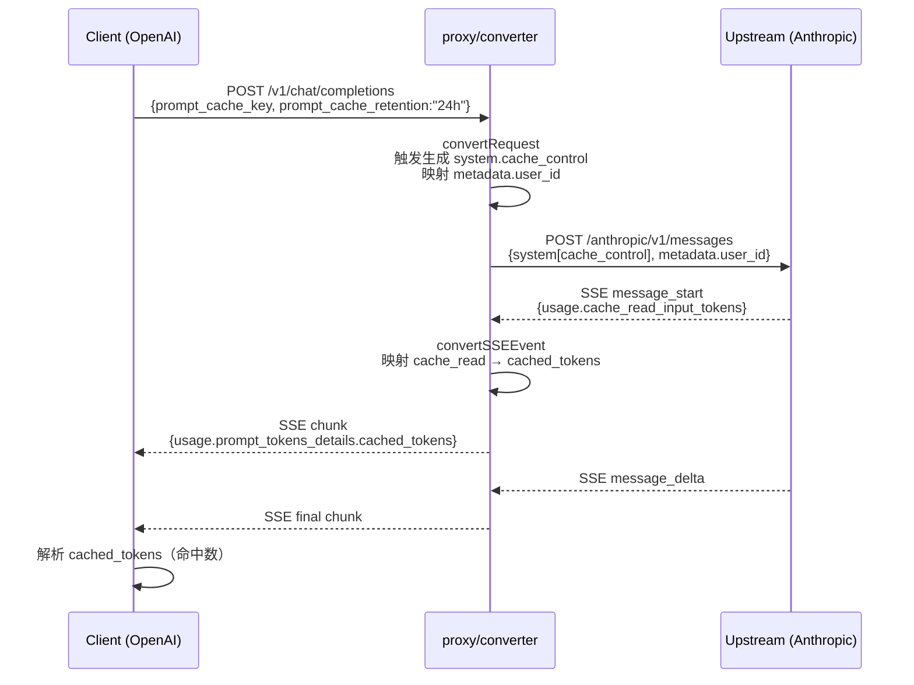
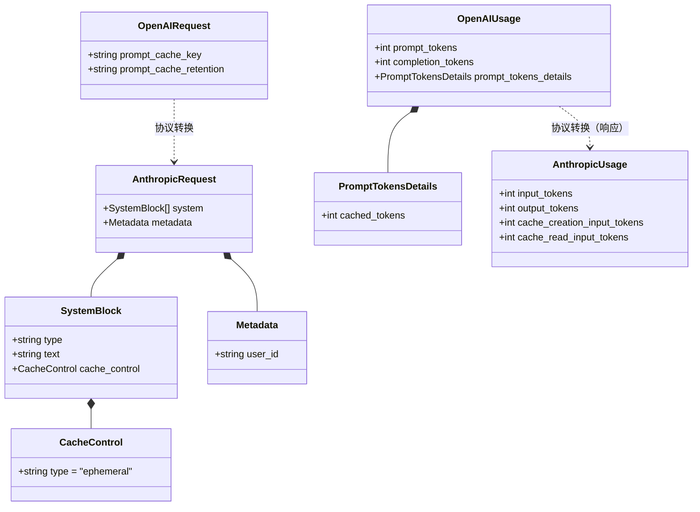

# 协议转换 cache 字段映射 设计文档

> **创建日期**：2026-06-21
> **背景**：用户用 OpenAI 协议调用 moonshot Anthropic 端点时，期望 prompt cache 命中但 SSE `cache_read_input_tokens = 0`。真因不是日志解析错，而是 `proxy/converter/` 在 OpenAI↔Anthropic 协议转换时**完全没映射 cache 字段**——客户端设的 `prompt_cache_key` / `prompt_cache_retention` 被透传丢弃，上游不启用 cache，命中永远为 0。

## 1. 问题根因

### 1.1 现象（NDJSON + proxy-debug 实证）

```
场景 A（用户实测 6/6 #6）：OpenAI 客户端 + moonshot OpenAI 端点
  client:  { prompt_cache_retention: "24h", prompt_cache_key: "user_xxx", ... }
  upstream: { prompt_cache_retention: "24h", prompt_cache_key: "user_xxx" }  ← 直接转发
  response: usage.prompt_tokens_details.cached_tokens = 8                   ← 命中 ✅

场景 B（用户实测 6/5 #5）：OpenAI 客户端 + moonshot Anthropic 端点
  client:  { prompt_cache_retention: "24h", prompt_cache_key: "user_xxx", ... }
  upstream: { model, stream, max_tokens, messages }                          ← converter 丢字段
  response: usage.cache_read_input_tokens = 0                                ← 未命中 ❌
```

### 1.2 根因：协议转换不映射 cache 字段

| 含义 | OpenAI 协议 | Anthropic 协议 | 转换层处理 |
|---|---|---|---|
| **cache 键** | `prompt_cache_key: "user_xxx"` | `metadata.user_id: "user_xxx"` | ❌ 透传丢弃 |
| **cache 启用** | `prompt_cache_retention: "24h"\|"1h"` | `system[].cache_control: { type: "ephemeral" }` | ❌ 透传丢弃 |
| **cache 命中（响应）** | `usage.prompt_tokens_details.cached_tokens` | `usage.cache_read_input_tokens` | ❌ 响应层不映射 |
| **cache 创建（响应）** | （无标准字段） | `usage.cache_creation_input_tokens` | ❌ 响应层不映射 |

### 1.3 架构定性

代理是**协议转换 + 透传**服务，**不替客户端决定是否启用 cache**。cache 是客户端语义：
- 客户端传 cache 启用信号，代理忠实转换成上游能接受的格式
- 客户端不传，代理不强制注入（**纯透传**）
- 代理**不配置 cache 启用、不强制加 cache_control、不兜底注入**

## 2. cache 跨协议字段模型

### 2.1 缓存控制两个维度

```
维度1: cache 启用信号
  OpenAI:    prompt_cache_retention: "24h" | "1h"   ← 1h 是默认值
  Anthropic: system[].cache_control: { type: "ephemeral" }
  含义: 「我想要 cache，请上游启用」

维度2: cache 命中报告
  OpenAI:    usage.prompt_tokens_details.cached_tokens: N
  Anthropic: usage.cache_read_input_tokens: N
  含义: 「本次请求有多少 input token 命中了 cache」

两维度独立：
  客户端不传启用信号 → 上游不启用 → 命中永远 0
  客户端传启用信号   → 上游启用   → 后续请求才有命中可能
```

### 2.2 跨协议对照表

| 控制维度 | OpenAI 格式 | Anthropic 格式 |
|---|---|---|
| **cache 键** | `prompt_cache_key: "user_xxx"` | `metadata.user_id: "user_xxx"` |
| **cache 启用** | `prompt_cache_retention: "24h"\|"1h"` | `system[].cache_control: { type: "ephemeral" }` |
| **cache 命中** | `usage.prompt_tokens_details.cached_tokens: N` | `usage.cache_read_input_tokens: N` |
| **cache 创建** | （无标准字段；保留 raw 值供诊断） | `usage.cache_creation_input_tokens: N` |

## 3. 设计决策

### 3.1 决策记录

| 决策 | 备选 | 选定 | 理由 |
|---|---|---|---|
| cache 启用信号映射 | A. 只在 system 块加 cache_control / B. system + 最近 N 条消息 / C. 缺省也加 | **A + 缺省不加**（用户决策 D） | 客户端传才生成 → 尊重意图；缺省透明 → 不替客户端决定 |
| 反向（Anthropic→OpenAI） cache 启用 | 固定 `"24h"` / 不生成 / 看 key 存在 | **固定 `"24h"`**（用户决策 A） | Anthropic `cache_control: ephemeral` = 显式要 cache，代理尊重意图 |
| 保留 raw 字段 | 全部丢弃 / 全部保留 | **保留** cache_creation_input_tokens | 诊断价值高；OpenAI 端不识别但无副作用 |
| `safety_identifier` 字段 | 一并处理 / 暂不处理 | **暂不处理** | 本 PR 聚焦 cache，其他字段后续 PR |
| cache 启用触发生成的位置 | 只 system / system + 最后 N 条消息 | **只 system 块** | 简单，符合 Anthropic 官方推荐 |

### 3.2 触发生成规则（D 决策）

**OpenAI → Anthropic**：
```
if (openaiBody.prompt_cache_retention === "24h" || "1h") {
  // 取最后一个 system 块（若没有则不创建——透明）
  if (result.system && result.system.length > 0) {
    result.system[result.system.length - 1].cache_control = { type: "ephemeral" }
  }
}
if (openaiBody.prompt_cache_key) {
  result.metadata = { ...result.metadata, user_id: openaiBody.prompt_cache_key }
}
```

**Anthropic → OpenAI**（A 决策）：
```
if (anthropicBody.system?.some(b => b.cache_control)) {
  result.prompt_cache_retention = "24h"   // 固定 24h
  // metadata.user_id → prompt_cache_key（如果存在）
  if (anthropicBody.metadata?.user_id) {
    result.prompt_cache_key = anthropicBody.metadata.user_id
  }
}
```

## 4. 架构设计

### 4.1 修改文件清单

```
src/main/proxy/converter/
├── request.ts
│   └── openaiToAnthropicRequest()        [改] 加 cache 启用触发生成 + cache_key 映射
│
├── response.ts
│   ├── anthropicToOpenAIResponse()       [改] 加 usage 字段映射（cache_read → cached_tokens）
│   └── openAIToAnthropicResponse()       [改] 加 usage 字段映射（cached_tokens → cache_read）
│
└── sse.ts
    ├── formatAnthropicMessageStartToOpenAI()    [改] message.usage 完整透传
    ├── formatAnthropicMessageDeltaToOpenAI()     [改] data.usage 完整透传
    ├── formatOpenAIUsageOnlyClose()              [改] cache 字段映射
    └── formatOpenAIMessageStart()                 [改] cache 字段映射
```

### 4.2 数据流（OpenAI 客户端 + Anthropic 上游）

```
┌──────────────────┐
│  Client App      │  OpenAI 协议: { prompt_cache_key, prompt_cache_retention:"24h", ... }
└────────┬─────────┘
         │ HTTP POST /v1/chat/completions
         ▼
┌─────────────────────────────────────────────┐
│  proxy/converter/request.ts                 │
│  openaiToAnthropicRequest()                 │
│                                             │
│  if (prompt_cache_retention) {              │  ← 新增
│    system[last].cache_control =             │  ← 新增
│      { type: "ephemeral" }                  │  ← 新增
│  }                                          │
│  if (prompt_cache_key) {                    │  ← 新增
│    metadata.user_id = key                   │  ← 新增
│  }                                          │
└────────┬────────────────────────────────────┘
         │ HTTP POST /anthropic/v1/messages
         │ { system: [..., cache_control:{type:"ephemeral"}], metadata:{user_id} }
         ▼
┌──────────────────┐
│  Upstream LLM    │  moonshot / mimo / Claude  ← 服务端启用 cache
│                  │
│  SSE event:      │
│  message_start:  { usage: { cache_read_input_tokens, cache_creation_input_tokens } }
│  message_delta:  { usage: { ... } }
└────────┬─────────┘
         │ SSE events
         ▼
┌─────────────────────────────────────────────┐
│  proxy/converter/sse.ts                     │
│  formatAnthropicMessageDeltaToOpenAI()      │
│                                             │
│  if (data.usage?.cache_read_input_tokens) { │  ← 新增
│    chunk.usage.prompt_tokens_details = {    │  ← 新增
│      cached_tokens: cache_read              │  ← 新增
│    }                                        │
│  }                                          │
└────────┬────────────────────────────────────┘
         │ SSE to client
         ▼
┌──────────────────┐
│  Client App      │  收到 cache 命中数据
└──────────────────┘
```

### 4.3 数据流（Mermaid sequenceDiagram）



### 4.4 字段映射契约（classDiagram）



## 5. 验收标准

### 5.1 请求层（request.ts）

- [ ] OpenAI 客户端传 `prompt_cache_retention: "24h"` + 至少一条 system 消息 → Anthropic 请求 system 末尾块有 `cache_control: { type: "ephemeral" }`
- [ ] OpenAI 客户端传 `prompt_cache_retention: "1h"` + 至少一条 system 消息 → Anthropic 请求 system 末尾块有 `cache_control: { type: "ephemeral" }`
- [ ] OpenAI 客户端传 `prompt_cache_key: "user_123"` → Anthropic 请求 `metadata.user_id = "user_123"`
- [ ] OpenAI 客户端两个都传 → 同时生成 cache_control 和 metadata.user_id
- [ ] OpenAI 客户端**都不传** → Anthropic 请求 system 块无 cache_control，metadata 无 user_id（透明）
- [ ] OpenAI 客户端**无 system 消息**但传了 `prompt_cache_retention` → 不报错，不创建 system（透明）
- [ ] Anthropic 客户端 `system[].cache_control: { type: "ephemeral" }` → OpenAI 请求 `prompt_cache_retention: "24h"`
- [ ] Anthropic 客户端 `metadata.user_id: "user_123"` → OpenAI 请求 `prompt_cache_key: "user_123"`

### 5.2 响应层（response.ts）

- [ ] Anthropic 响应 `usage.cache_read_input_tokens: 1500` → OpenAI 响应 `usage.prompt_tokens_details.cached_tokens: 1500`
- [ ] Anthropic 响应 `usage.cache_creation_input_tokens: 800` → OpenAI 响应 `usage.cache_creation_input_tokens: 800`（保留）
- [ ] OpenAI 响应 `usage.prompt_tokens_details.cached_tokens: 800` → Anthropic 响应 `usage.cache_read_input_tokens: 800`
- [ ] 双向 0 值字段正确透传

### 5.3 SSE 层（sse.ts）

- [ ] Anthropic `message_start` 事件 `message.usage.cache_read_input_tokens: 1365` → OpenAI 首 chunk `usage.prompt_tokens_details.cached_tokens: 1365`
- [ ] Anthropic `message_delta` 事件 `data.usage.cache_read_input_tokens: 114` → OpenAI 终止 chunk 同样映射
- [ ] OpenAI `stream_options.include_usage` 终止 chunk `usage.prompt_tokens_details.cached_tokens: 8` → Anthropic `message_delta.usage.cache_read_input_tokens: 8`

### 5.4 不破坏现有行为

- [ ] 现有 905+ 测试全部通过
- [ ] 现有 OpenAI→Anthropic thinking 转换不受影响
- [ ] 现有 tool_choice / tool_calls 转换不受影响
- [ ] 现有直接转发（OpenAI→OpenAI / Anthropic→Anthropic）不受影响
- [ ] `npx tsc -b --noEmit` exit 0
- [ ] `npm run lint` 0 errors

## 6. 不做的事（YAGNI）

- ❌ 不动 `safety_identifier` 字段映射（后续 PR）
- ❌ 不动 `user` 字段（OpenAI 已 deprecated，未在用）
- ❌ 不在 message 块（非 system）加 cache_control
- ❌ 不做 cache_creation 次数聚合
- ❌ 不缓存 prompt_cache_retention 的转换结果
- ❌ 不改 IPC 契约（本次纯 converter 内部改造）

## 7. 风险

| 风险 | 概率 | 缓解 |
|---|---|---|
| 现有 905 测试有依赖旧行为 | 中 | 改前先跑 baseline 锁定；改后逐项对比 |
| `prompt_cache_retention: "1h"` 转 `cache_control: ephemeral` 可能不匹配某些上游 | 低 | OpenAI 1h 是默认值；Anthropic ephemeral 也是基础类型，语义对齐 |
| SSE message_start usage 在 Anthropic 端点延迟出现 | 低 | 现有代码已处理 usage 透传，加 cache 字段是增量子集 |
| `metadata.user_id` 与 Anthropic 已有 metadata 字段冲突 | 低 | 用 `...result.metadata, user_id` 合并而非覆盖 |

## 8. 测试策略

- **TDD 铁律**：先写失败测试，看到失败再改实现
- **测试位置**：
  - `src/main/proxy/converter/__tests__/request.test.ts`（如不存在则新建）
  - `src/main/proxy/converter/__tests__/response.test.ts`
  - `src/main/proxy/converter/__tests__/sse.test.ts`
- **Mock**：单元测试不需要 mock，纯函数测试
- **覆盖率**：每个验收标准 1 个测试用例
- **集成**：现有 `extractUsageFromSSE` 的 NDJSON 集成测试不受影响（converter 改动后 SSE usage 透传层会自然包含新字段）

## 9. 实施分层

L0：契约定义（本 spec）
L1：request.ts 修改（OpenAI→Anthropic + Anthropic→OpenAI 请求 cache 字段映射）
L2：response.ts 修改（双向响应 usage cache 字段映射）
L3：sse.ts 修改（双向 SSE usage cache 字段映射）
L4：集成验证（全量测试 + lint + tsc）

---

**状态**：待用户审阅 → 派子代理结构审查 → Controller 自审 → 用户最终确认 → writing-plans
